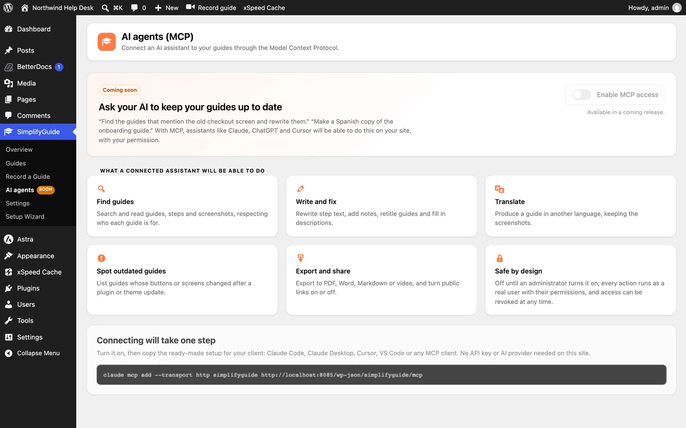

**This is planned, not available yet.** The **SimplifyGuide → AI agents**
screen is a preview of what is coming. Nothing on it works yet, and the plugin
does not currently expose an MCP server.

## What it is for

MCP (the Model Context Protocol) lets AI assistants such as Claude, ChatGPT and
Cursor use tools on other systems. Connected to SimplifyGuide, an assistant
could handle requests like:

- "Find the guides that mention the old checkout screen and rewrite them."
- "Make a Spanish copy of the onboarding guide."

## What is planned

A connected assistant is planned to be able to:

| Ability | What it would do |
| --- | --- |
| **Find guides** | Search and read guides, steps and screenshots, respecting who each guide is for |
| **Write and fix** | Rewrite step text, add notes, retitle guides and fill in descriptions |
| **Translate** | Produce a guide in another language, keeping the screenshots |
| **Spot outdated guides** | List guides whose buttons or screens changed after a plugin or theme update |
| **Export and share** | Export to PDF, Word, Markdown or video, and turn public links on or off |

## How it is planned to stay safe

- **Off by default.** Nothing is reachable until an administrator turns on
  **Enable MCP access**.
- **Real users, real permissions.** Every action runs as a WordPress user, with
  that user's capabilities — an assistant connected as an Author could do only
  what that Author can do. Authentication is planned to use WordPress
  application passwords.
- **Revocable.** Access can be withdrawn at any time, for example by revoking
  the application password.
- **Read-only option.** A read-only mode is planned, for assistants that should
  find and read guides but never change them.

## How connecting is planned to work

One step: turn MCP access on, then copy the ready-made setup for your client —
Claude Code, Claude Desktop, Cursor, VS Code or any MCP client. It is planned
to need no API key or AI provider on your site, because the assistant brings
its own model.

There is no release date. Until then, the [REST API](/product/simplifyguide/docs/rest-api/)
already covers reading, creating and updating guides with an application
password.
