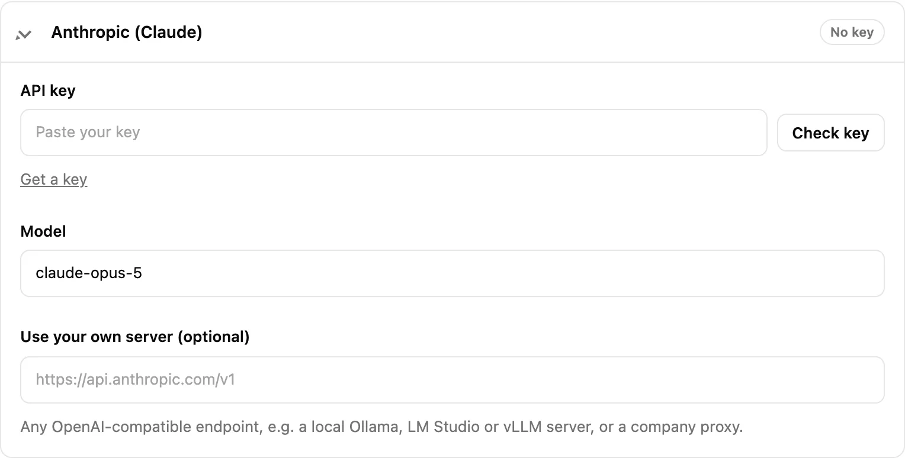

AI is optional. Without it, SimplifyGuide writes every step from its own rules
("In the left menu, go to Posts → Add New"), which read well on most WordPress
screens. AI polishes that wording, rewrites single steps, and turns voice
narration into notes.

Providers are set up under **SimplifyGuide → Settings → AI writing**, in the
**Providers** list at the bottom of the tab.

## The providers

| Provider | Writes steps | Transcribes voice | Default model | Where to get a key |
| --- | --- | --- | --- | --- |
| **WordPress AI (site connection)** | Yes | No | Chosen in WordPress | No key here; uses **Settings → Connectors** |
| **Anthropic (Claude)** | Yes | No | `claude-opus-5` | console.anthropic.com/settings/keys |
| **OpenAI** | Yes | Yes (`whisper-1`) | None — pick after checking the key | platform.openai.com/api-keys |
| **DeepSeek** | Yes | No | `deepseek-chat` | platform.deepseek.com/api_keys |
| **OpenRouter** | Yes | No | None — pick after checking the key | openrouter.ai/keys |
| **Groq** | Yes | Yes (`whisper-large-v3`) | None — pick after checking the key | console.groq.com/keys |
| **Custom (OpenAI-compatible server)** | Yes | Yes (`whisper-1`) | None | Your server |

Each card has a **Get a key** link that opens the provider's key page.

### WordPress AI (site connection)

On WordPress 7.0 and later, a site owner can connect an AI provider once for
every plugin under **Settings → Connectors**. When that is available,
SimplifyGuide lists **WordPress AI (site connection)** first and makes it the
default, so there is no separate key to paste. The card shows **Connected** or
**Not connected**, a **Test connection** button, and a link to **Manage
connections in Settings → Connectors**.

On older WordPress versions, or where AI has been switched off for the site,
this option does not appear and the default provider is Anthropic.

### Anthropic, OpenAI, DeepSeek, OpenRouter and Groq

Each is a key you create in the provider's own console and paste here. You pay
the provider directly for what you use. Anthropic uses its own API; the others
all speak the OpenAI-compatible protocol.

### Custom (OpenAI-compatible server)

For anything else that speaks the OpenAI API: a local **Ollama**, **LM
Studio** or **vLLM** server, a hosted model gateway, or a company proxy. Set
**Server URL** (for example `http://localhost:11434/v1` for Ollama), a model
name, and a key if your server needs one.

"Local" means local to your WordPress server, since requests are made by the
server, not your browser. A model running on your laptop is only reachable if
WordPress runs there too.

## Setting up a provider

1. Choose it in **Provider** at the top of the tab.
2. Open its card in the **Providers** list and paste the key into **API key**.
3. Press **Check key**. SimplifyGuide lists the models the key can use, then
   makes one tiny test request — the only reliable way to learn whether the
   account still has credits.
4. Pick a **Model**. After a successful check the field suggests every model
   the key can use; if it was empty, a sensible chat model is chosen for you.
5. Press **Save changes**.

A successful check reads **Key works. N models available; test request to …
succeeded.** You can check a key before saving it.

Other fields on the card:

| Field | What it is for |
| --- | --- |
| **Show** | Reveals the saved key. Only appears once a key is saved. |
| **Model** | The model that writes step text. Any model ID the provider accepts. |
| **Transcription model** | Voice-capable providers only (OpenAI, Groq, Custom). |
| **Use your own server (optional)** | Point this provider at a different OpenAI-compatible endpoint, such as a proxy. Leave empty for the provider's own address. On the Custom card this field is **Server URL** and is required. |
| **Remove saved key on save** | Deletes the stored key when you press **Save changes**. |

Leaving **API key** blank when you save keeps the key you already stored. A
saved key is never printed back into the page; the field shows only its last
four characters.

## Voice transcription

Transcription uses its own provider, set under **Settings → Voice narration →
Transcribe with**: OpenAI (the default), Groq or Custom. It uses the key from
that provider's card in **AI writing → Providers**, so you can write with
Anthropic and transcribe with OpenAI, for example.

Narration files up to 25 MB are accepted, the common limit of transcription
APIs. See [Voice narration](/product/simplifyguide/docs/voice-narration/).

## What is sent

Requests go from your server straight to the provider you chose. Your browser
never talks to the provider and never sees the key.

| Feature | Sent to the provider |
| --- | --- |
| Writing step descriptions | The guide title and, per step: its action, current text, element label, page path, and a little page context (element type, nearest section heading, page heading, page title, field help text) |
| Rewriting one piece of text | That text only, up to 4,000 characters |
| Transcribing narration | The narration audio file |
| **Check key** / **Test connection** | A model list request and a one-word test prompt |

Never sent: screenshots, narration (unless you are transcribing), passwords,
anything Smart Blur detected, or the value of an element you blurred. Step
text can quote an ordinary value you typed — *Type “Summer sale” in “Title”* —
and that text is what the model rewrites, so it goes too. The instructions
given to the model also tell it never to include passwords or personal data. The provider's own terms and privacy policy apply
to what it receives.

## Keys are encrypted at rest

API keys are stored in the `simplifyguide_ai` option, encrypted with
AES-256 using a secret derived from your site's `AUTH_KEY` salt. A database
dump on its own does not reveal them.

Two consequences:

- If you change your site's salts, stored keys can no longer be decrypted.
  Paste them again.
- If PHP's OpenSSL extension is missing, keys are stored base64-encoded
  instead — obscured, not encrypted. Almost every host has OpenSSL.

## Who can use AI

AI calls cost the site owner money, so the bar is higher than for recording.

| Action | Needs |
| --- | --- |
| Rewrite steps, transcribe narration | `publish_posts` (Authors and above) |
| Change providers, check or reveal keys | `manage_options` (Administrators) |

Users who can record but not publish — Contributors, by default — still get
rule-based step text; the editor treats AI as unavailable for them, and their
narration is saved as audio without being transcribed. Developers can
change the capability with the
[`simplifyguide_ai_capability`](/product/simplifyguide/docs/hooks/) filter.

## Rate limit

Each user can make **60 AI requests per hour**. A request is one rewrite, one
"describe these steps" call (however many steps it covers), or one
transcription. Past the limit, the user sees **You have reached the hourly
limit for AI requests. Try again in N minutes.**

Change or remove the limit with the
[`simplifyguide_ai_rate_limit`](/product/simplifyguide/docs/hooks/) filter;
zero or less turns it off.

## Error messages

SimplifyGuide turns provider errors into a sentence you can act on:

| Message | What to do |
| --- | --- |
| **… rejected the API key. Check that it is correct and active.** | The key is wrong, revoked or for another account. Paste a fresh one. |
| **Your … account has no credits left. Add credits or use another provider.** | Top up with the provider, or switch provider. |
| **The model "…" was not found at …** | Press **Check key** and pick a model from the list. |
| **… is rate-limiting requests. Wait a minute and try again.** | The provider's own limit, not SimplifyGuide's. |
| **… had a server error (5xx). Try again shortly.** | The provider is having trouble. |
| **Could not reach …** | Your server could not connect: firewall, DNS, or a wrong **Server URL**. |
| **… answered, but not in the expected format.** | Try again, or choose a larger model. Small local models sometimes fail here. |

See [Troubleshooting](/product/simplifyguide/docs/troubleshooting/) for more.
