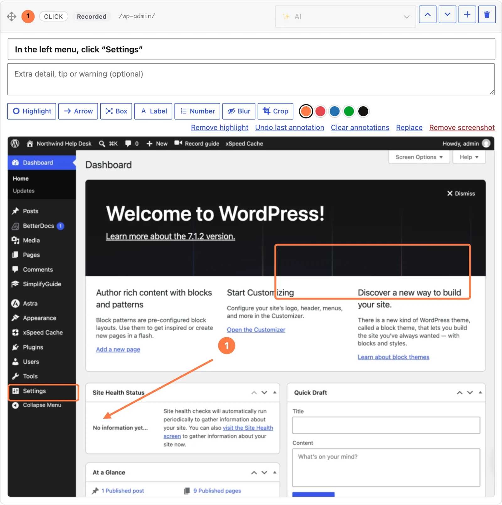

Every screenshot in the [editor](/product/simplifyguide/docs/editor/) has a
toolbar above it. Use it to draw attention to the part of the screen that
matters, and to hide or cut away the parts that do not.

## Using the tools

1. Click a tool to turn it on. Click it again to turn it off.
2. Pick a colour from the swatches, if you want one other than the current
   colour.
3. Draw on the screenshot: drag for **Highlight**, **Arrow**, **Box**,
   **Blur** and **Crop**; click once for **Label** and **Number**.
4. Press **Update** to save. (Blur and Crop save immediately — see below.)

**Highlight**, **Box**, **Blur** and **Crop** turn themselves off after one
use. **Arrow**, **Label** and **Number** stay on, so you can place several in a
row.

## The tools

| Tool | How | What it draws |
| --- | --- | --- |
| **Highlight** | Drag | The step's highlight: an outline in your brand colour around the thing to use |
| **Arrow** | Drag from tail to tip | An arrow in the chosen colour |
| **Box** | Drag | An outlined rectangle in the chosen colour |
| **Label** | Click where it should start | A rounded tag with white text; you are asked for the **Label text** |
| **Number** | Click | A numbered circle; numbers count up 1, 2, 3 on each step |
| **Blur** | Drag | Pixelates that area of the image |
| **Crop** | Drag | Cuts the image down to that area |

### Highlight

A step has one highlight. The recorder draws it around the element you
clicked; drawing a new one replaces it. It is always in your brand colour,
whatever swatch is selected.

The highlight is more than decoration. **Show me** uses its position as one of
the clues for finding the element on the live screen, so leave it on the thing
the reader should use. See
[Writing reliable guides](/product/simplifyguide/docs/reliable-guides/).

### Arrow, Box, Label and Number

These are the annotations. A step can hold up to 30. Very short drags are
ignored, so a stray click with **Arrow** or **Box** does not leave a speck on
the image.

Labels are limited to 200 characters. Keep them to a few words — they are drawn
on the image and do not wrap.

## Colours

The swatches are your brand colour (set in
[Branding](/product/simplifyguide/docs/branding/)) followed by red, blue, green
and near-black. The colour applies to annotations you draw after choosing it;
existing ones keep theirs. Your choice carries over from card to card until you
leave the page.

## Removing annotations

To the right of the swatches:

- **Remove highlight** — removes the step's highlight.
- **Undo last annotation** — removes the most recent arrow, box, label or
  number.
- **Clear annotations** — removes all of them from this step.

Each link only appears when there is something for it to remove. None of them
touches the screenshot itself.

## Annotations are kept separate from the screenshot

The highlight and annotations are stored with the step as positions relative
to the image, not painted into it. That means:

- They stay sharp and in proportion at any size, from a thumbnail to a
  full-screen video.
- You can change or remove them at any time without touching the image.
- **Replace** or **Remove screenshot** clears them, since they were drawn for
  that image.

They are drawn wherever the guide is shown or rendered:

| Where | Highlight | Annotations |
| --- | --- | --- |
| Guide page in the Help Center | Yes | Yes |
| Block and shortcode embeds | Yes | Yes |
| PDF, Word, GIF and video exports | Yes | Yes |
| Web page (HTML) export | Yes | Yes |
| Markdown export | No | No — it links to the plain screenshot |
| **Show me** panel | Yes | No |
| SimplifyGuide file (JSON) | Kept as data | Kept as data |

## Blur and Crop change the image

Unlike the other tools, **Blur** and **Crop** edit the pixels. The editor makes
a new image from the full-size original, uploads it, and uses it on every step
that showed the old one. The original is then deleted, so the private data it
contained does not stay in your Media Library.

This happens as soon as you let go of the mouse — you do not need to press
**Update**, and it cannot be undone. Restoring an earlier version from
[Version history](/product/simplifyguide/docs/version-history/) does not bring
the original back.

After a crop, the step's highlight and annotations are moved to match the new
edges. A highlight that falls outside the cropped area is removed; an
annotation that falls outside ends up pinned to the nearest edge, so check the step afterwards and remove what no longer makes
sense. Press **Update** to keep the adjusted positions.

**Blur** is for one-off areas you spot while editing. To hide email addresses,
keys and similar data automatically on every recording, use Smart Blur — see
[Privacy and Smart Blur](/product/simplifyguide/docs/privacy-and-smart-blur/).
