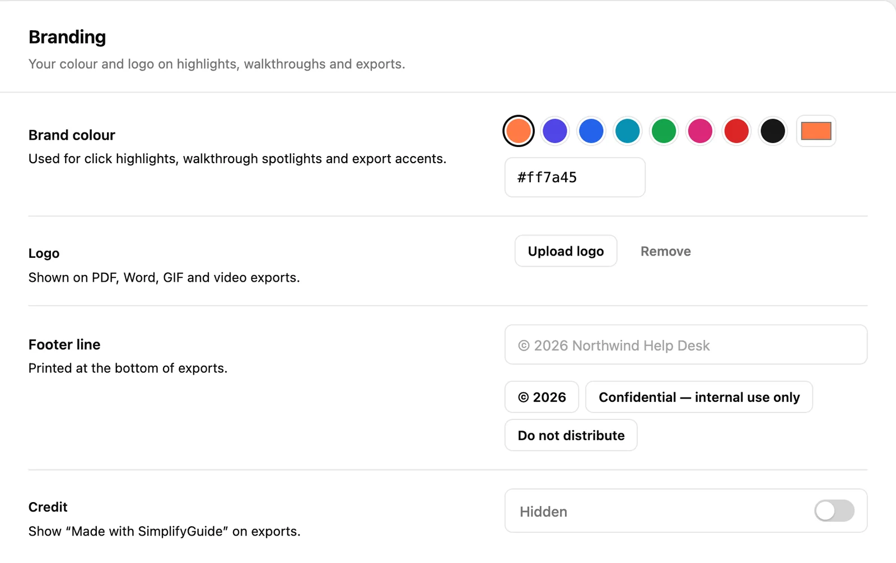

Branding lives under **SimplifyGuide → Settings → Branding**. Four settings
decide how guides look when other people see them: a colour, a logo, a footer
line and an optional credit.

## Brand colour

Default: `#ff7a45`, SimplifyGuide orange.

Pick one of the eight preset swatches, use **Pick any colour** for your
browser's colour picker, or type a hex value (`#rrggbb`) into the field. The
presets are:

| Swatch | Hex |
| --- | --- |
| Orange (default) | `#ff7a45` |
| Indigo | `#4f46e5` |
| Blue | `#2563eb` |
| Cyan | `#0891b2` |
| Green | `#16a34a` |
| Pink | `#db2777` |
| Red | `#dc2626` |
| Near-black | `#171717` |

The colour is used for:

- **Click highlights** — the box around the element each step is about, in
  embedded guides, the Help Center and exports.
- **Walkthroughs** — the outline and numbered label that **Show me** puts on
  the element to use.
- **Export accents** — the highlight boxes drawn on screenshots in PDF, Word,
  GIF and video exports, the step badges in GIF and video, and the glow on
  video title and closing cards.
- **SimplifyGuide's own screens** — buttons and accents in the plugin's admin
  pages.

You do not have to worry about contrast. Text drawn on the brand colour is
picked automatically — dark on light colours, white on dark ones — from the
colour's luminance.

Annotations you draw in the editor (arrows, boxes, labels and markers) carry
their own colour, which starts as SimplifyGuide orange; see
[Annotations](/product/simplifyguide/docs/annotations/).

## Logo

Default: none.

Press **Upload logo** to pick an image from your Media Library, **Change logo**
to swap it, or **Remove** to go back to no logo. Where it appears:

| Export | Where the logo goes |
| --- | --- |
| PDF | In the header of every page |
| Word (.docx) | At the top of the document |
| GIF | Top-right corner of each frame, on a light chip so dark logos stay visible, and on the closing frame |
| Video | On the title and closing cards |

A transparent PNG with a little padding works best. The logo is not shown in embeds or the Help Center — those already sit inside your own
site.

## Footer line

Default: empty. The field shows `© <year> <site name>` as a placeholder, but
nothing is printed until you type something.

Printed at the bottom of exports: in the footer of every PDF page and Word
page, and on the closing frame of GIF and video exports. Up to 200 characters.

Three presets fill the field in one click:

- **© \<year\>**
- **Confidential — internal use only**
- **Do not distribute**

## Credit

Default: **Hidden**.

Turn it on to add **Made with SimplifyGuide** to exports, next to the footer
line. It is off unless you choose to show it.

## What branding does not change

- **Existing downloads.** Exports are built when you press the button, so a
  new logo or colour applies to the next export, not to files already sent.
- **Markdown and HTML exports** carry no logo, footer or credit. The HTML
  export uses the brand colour for highlights, like an embedded guide.
- **The SimplifyGuide file** (`.simplifyguide.json`) holds the guide only,
  not your branding; the site that imports it applies its own.

See [Exports](/product/simplifyguide/docs/exports/) for every format.
