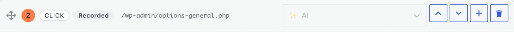

When you press **Finish** in the recorder, the guide opens in the editor. You
can also get there from the **Guides** dashboard with the pencil button on a
card, or with **Edit** in a guide's sidebar.

The editor is the standard WordPress post screen with two changes: the main
column holds the steps, and the sidebar holds the guide's sharing settings.

Nothing you change is stored until you press **Update** (or **Publish** on a
new guide) — with two exceptions, **Blur** and **Crop**, which are explained
below. If you try to leave with unsaved changes, the browser asks first.

## Title and description

The title is the guide's name everywhere: in the Help Center, on embeds, in
exports and at the top of the **Show me** panel. The recorder names the guide
from what you did; change it here if it is not quite right. See
[Automatic titles](/product/simplifyguide/docs/auto-titles/).

Under the title is an optional description, with the placeholder **What does
this guide help someone do? (optional)**. It appears under the title on the
guide page, on embeds and on the guide's card in the dashboard, and it is
searched by the dashboard search box.

## The Steps box

Each step is a card. Above the cards is a toolbar with **Rewrite all steps with
AI** (see [AI rewrite](/product/simplifyguide/docs/ai-rewrite/)), **Version
history** (see [Version history](/product/simplifyguide/docs/version-history/)),
and, if you narrated the recording, a player for the **Narration** with
**Transcribe into notes** and **Delete narration** (see
[Voice narration](/product/simplifyguide/docs/voice-narration/)).

### The card header

From left to right:

- **Drag handle** — drag a card by this handle to move it. Only the handle
  starts a drag, so you can still select text in the card.
- **Step number** — the step's position. Numbers update as you reorder.
- **Action** — what the step records: `click`, `input`, `select`, `check`,
  `uncheck`, `navigate`, `key`, `copy`, `paste`, `drag`, or `note` for a step
  you wrote by hand.
- **Source badge** — where the instruction text came from. Hover it for the
  explanation.

  | Badge | Meaning |
  | --- | --- |
  | **Recorded** | Written automatically from what you clicked while recording |
  | **AI** | Written by AI from the recorded step |
  | **Voice** | Transcribed from your narration |
  | **Edited** | Changed by hand after recording |
  | **Written** | Added by hand |

- **Page address** — the screen the step was recorded on, as a path on your
  site. **Show me** uses it to send readers to the right screen.
- **AI menu** — rewrite this one step. Disabled until AI is set up.
- **Move up** and **Move down** — move the step one place.
- **Add a text step after this one** — inserts an empty step below.
- **Delete step** — asks for confirmation, then removes the step.

The source badge updates as you work: type in a recorded or AI step and it
becomes **Edited**. A step you added by hand stays **Written**.

### Step text and note

Each card has two text fields:

- **The instruction** — one line, placeholder **What should the reader do?**
  This is the step's title everywhere it appears.
- **The note** — optional, placeholder **Extra detail, tip or warning
  (optional)**. Use it for why, what happens next, or what to watch out for.
  Notes get their own source badge once they have one.

Keep the instruction short and name the exact button or field. Put everything
else in the note.

### Adding steps

- **+ Add a text step** under the last card adds a step with no screenshot and
  no element to point at — a heading, a tip, or a step that cannot be recorded.
- The **+** button on a card adds one directly after it.
- **Record more steps** under the last card opens the recorder and appends new
  steps to this guide.

A text step you leave completely empty is dropped when you save.

### Screenshots

Under a step's text is its screenshot, with the annotation toolbar above it.
The drawing tools are covered in
[Annotations](/product/simplifyguide/docs/annotations/). At the right of the
toolbar:

- **Replace** — opens the Media Library so you can pick a different image.
  Replacing a screenshot clears that step's highlight and annotations, since
  they were drawn for the old image.
- **Remove screenshot** — removes the image from the step, along with its
  highlight and annotations. The step stays.

A step without a screenshot shows an **Add screenshot** button instead.

## The sidebar

### Record & share

- **Record more steps** — opens the recorder to add steps to the end of this
  guide. On a guide with no steps yet it reads **Record steps**.
- **Show me (live walkthrough)** — starts the walkthrough of this guide. See
  [Show me](/product/simplifyguide/docs/show-me/).
- **Preview / Print to PDF** — opens the guide as readers see it in the Help
  Center, where you can print it.
- **Embed** — the shortcode for this guide, selected when you click it, with a
  reminder that you can use the SimplifyGuide block instead. See
  [Embedding a guide](/product/simplifyguide/docs/embed/).

The last three appear once the guide has at least one step.

### Who sees this guide

**Show in the Help Center for:** lists every role on your site. Tick the roles
this guide is for. Leave all unticked to show it to every logged-in user.

New guides start with the roles chosen in the setup wizard, if any.

Below the roles is **Public — visitors can see it where it is embedded**. Read
[Public guides](/product/simplifyguide/docs/public-links/) before you tick it.

Both settings only take effect once the guide is published. A draft is visible
only to people who can edit it.

### Publish

The standard WordPress box. **Save Draft** keeps the guide to yourself;
**Publish** puts it in the Help Center for the people you chose. On a published
guide, **Update** saves your changes.

### Export

Download the guide as video, GIF, PDF, Word, HTML, Markdown or a SimplifyGuide
file. See [Exports](/product/simplifyguide/docs/exports/).

## Blur and Crop save straight away

Every other change waits for **Update**. **Blur** and **Crop** do not: they
make a new image, upload it, and put it in place of the original on every step
that used it. The original is then deleted from the Media Library, so the
private data it showed does not linger.

That makes them permanent. Undoing the edit, or restoring an older version,
does not bring the original image back.
