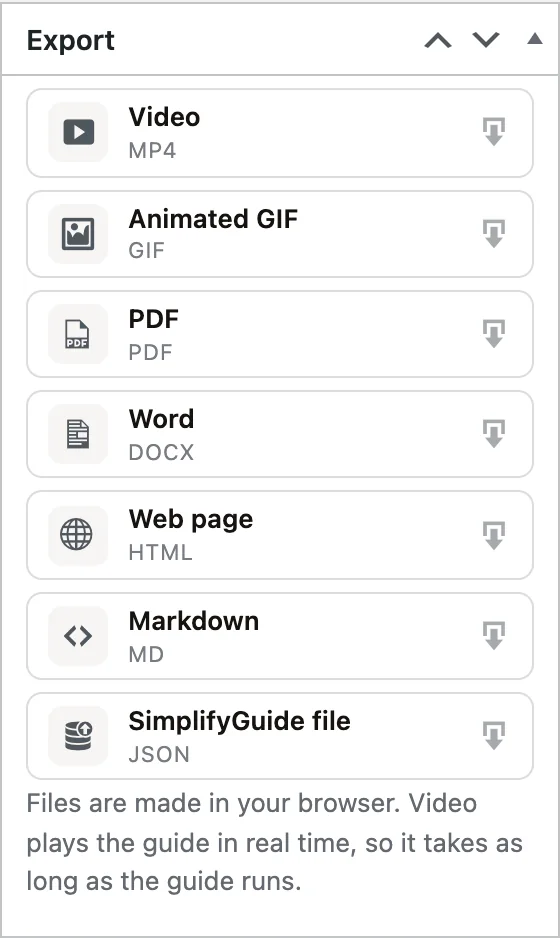

Every guide can be downloaded in seven formats, for the places a Help Center
link will not reach: a support ticket, a training deck, an onboarding email, a
printed binder, another site.

## Where to export

- **In the editor** — the **Export** box in the sidebar.
- **On the guide page** — the **Download** card in the sidebar. Anyone who can
  see the guide can download it, not only authors.

Click a format to download it. A progress bar shows while the file is made,
with **Cancel** to stop. When it is done you see **Downloaded** and the file
name, which is taken from the guide's title.

One export runs at a time; the other buttons wait until it finishes.

## The formats

| Format | File | Best for |
| --- | --- | --- |
| **Video** | MP4 or WebM | Sharing a task as something people watch |
| **Animated GIF** | GIF | Chat, tickets, emails and READMEs, where video does not play inline |
| **PDF** | PDF | Sending, attaching and archiving |
| **Word** | DOCX | Editing the guide further, or pasting into your own documents |
| **Web page** | HTML | A single page to open in any browser |
| **Markdown** | MD | Wikis, knowledge bases and code repositories |
| **SimplifyGuide file** | JSON | Moving a guide to another site |

### Video

A produced screen recording of the guide. It opens with a title card showing
the guide title, number of steps, date and site, and closes with a **Guide
complete** card.

In between, a camera follows the action the way a person filming would. It
zooms in once, then glides smoothly from one place where something happens to
the next, and only zooms back out when a step has nothing to point at. It does
not zoom in and out on every click. A pointer travels to each target and
clicks, a soft spotlight marks it, and the step's instruction appears as a
caption, always in the same place at the bottom. When a step moves to a new
screen, the new screen dissolves in under the camera. Keyboard shortcuts get a
card of their own.

If the guide has [narration](/product/simplifyguide/docs/voice-narration/),
it becomes the soundtrack, and each step stays on screen for as long as it took
while you recorded, so the voice lines up with the picture. Without narration,
each step stays up long enough to read its text — at least a few seconds.

Two things to know:

- **It plays in real time.** The video is recorded as it plays, so making a
  two-minute video takes about two minutes. Keep the tab open until it
  finishes.
- **The browser decides the format.** MP4 is used where the browser can record
  it, WebM otherwise — the button shows which you will get. If the browser
  cannot record video at all, the button is disabled with **This browser cannot
  record video. Try Chrome, Edge or Firefox.**

### Animated GIF

One frame per step: the instruction in a caption bar above the annotated
screenshot, each shown for two and a half seconds, then looping. Up to 960
pixels wide. GIFs are limited to 256 colours per frame, so screenshots with
gradients or photos look slightly grainy.

### PDF

A4 pages with a cover (title, description and number of steps) followed by a
card for each step: its number, instruction, note and annotated screenshot.
Pages are numbered.

Each card is drawn as an image, which is what lets any language render
correctly — Chinese, Arabic, Hindi and so on. The catch is that the step text
in the PDF cannot be selected or searched. If you need selectable text, open
the guide page and use **Print**, then save as PDF from the print dialog.

### Word

A `.docx` document with the guide title and description, then each step as a
heading — "Step 1: " followed by its instruction — with its note and annotated
screenshot beneath. A4, and it opens in Word, Google Docs, Pages and
LibreOffice. Everything is editable, so this is the format to use when the
guide is a starting point for your own document.

### Web page (HTML)

A single HTML page with the guide in the same layout as the Help Center and
the styles built in, so it looks right in any browser without your theme.

The screenshots are not inside the file: the page loads them from your site.
It displays them wherever your site can be reached, and shows the text only
where it cannot.

### Markdown

The title, the description, and a numbered list of steps with the instruction
in bold, the note beneath, and a link to the full-size screenshot on your site.
The links point at the plain screenshots, so highlights and annotations are
not included.

### SimplifyGuide file (JSON)

A complete copy of the guide for moving it to another site running
SimplifyGuide, saved as `your-guide.simplifyguide.json`. It holds the title,
description, starting screen, and every step — instruction, note, source badge,
highlight, annotations, and everything **Show me** needs to find the element —
with the screenshots embedded in the file.

It does not include the narration audio, who the guide is shown to, or the
Public setting.

## Importing a SimplifyGuide file

1. Go to **SimplifyGuide → Guides** and press **Import guide**. It is also on
   the **Classic UI** list.
2. Choose the `.simplifyguide.json` file.
3. When it finishes, the new guide opens in the editor.

The import is always a new **draft**, so nothing appears in anyone's Help
Center until you publish it. If a guide with the same title exists, the new
one gets a distinct title. Screenshots are added to your Media Library. The
guide gets your site's default audience, and is not public.

Limits:

- Files up to 40 MB, and up to 200 steps.
- Screenshots must be PNG, JPEG or WebP, up to 8 MB each. Any that are not
  are skipped; the steps are still imported.
- A file made by a newer version of SimplifyGuide is refused with **This file
  was made by a newer version of SimplifyGuide. Update the plugin, then import
  it again.**

You need to be able to author guides and upload files to import.

Step addresses are stored as paths on the site, such as
`/wp-admin/options-general.php`, so **Show me** works on the new site as long
as it has the same screens.

## Branding

Video, GIF, PDF and Word exports carry your branding from
**SimplifyGuide → Settings → Branding**:

| Setting | Where it appears |
| --- | --- |
| **Brand colour** | Highlights, step numbers, captions and accents |
| **Logo** | Video frames and end card, GIF end card, every PDF page header, the Word document |
| **Footer line** | Video and GIF end cards, every PDF page, the Word footer |
| **Credit** — "Made with SimplifyGuide" | Same places as the footer line, when turned on |

Annotations keep the colours you drew them in. The GIF only gets an end card
when a logo, footer line or credit is set.

The Web page export uses your brand colour. Markdown and the SimplifyGuide
file carry no branding. See
[Branding](/product/simplifyguide/docs/branding/).

## Files are made in your browser

Video, GIF, PDF, Word and the SimplifyGuide file are built in your browser from
the guide's data. Nothing is sent to an outside service, and your server does
no extra work — but a large guide can take a moment, and a slow computer
takes longer. Web page and Markdown are small text files that your site
prepares and sends directly.
