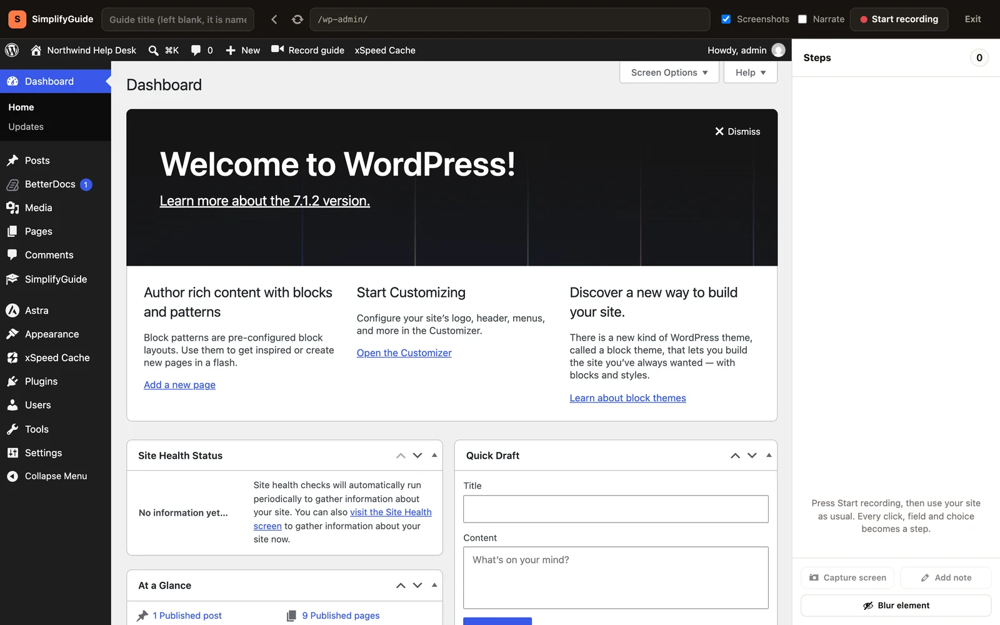
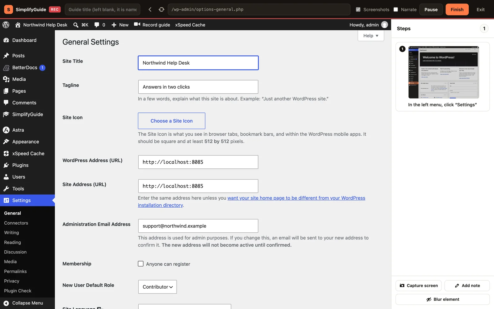
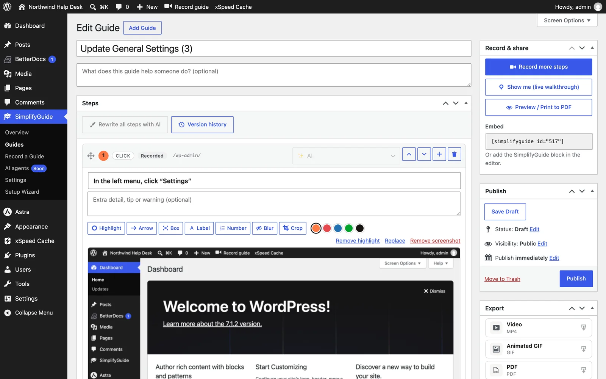
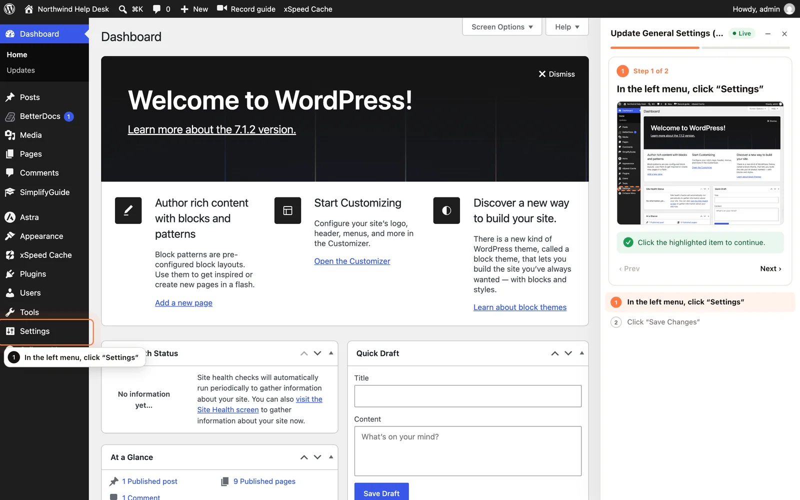

This tutorial records a real task end to end: changing your site title and
tagline under **Settings → General**. It takes about five minutes and touches
every part of SimplifyGuide you will use day to day — the recorder, the editor,
publishing and **Show me**.

You will change your real site title and tagline while recording. A field is
only recorded when its value changes, so type something different, and change
it back afterwards if you want to keep the old one.

## Before you start

- You need a role that can record guides (Author and above) and can change
  site settings (Administrator), because the task itself is an admin task.
- Use Chrome or Edge. Firefox and Safari can only share a whole window, where
  nothing can be blurred, so they record steps without screenshots. See
  [Recording](/product/simplifyguide/docs/recording/).
- Your site should be on HTTPS or `localhost`, or steps will have no
  screenshots.

## 1. Open the recorder

Go to **SimplifyGuide → Record a Guide**. The recorder fills the browser
window: a bar across the top, your site in the middle, and an empty **Steps**
panel on the right.

Leave the title field empty. SimplifyGuide will name the guide from what you do.

Keep **Screenshots** ticked and leave **Narrate** off for now.

## 2. Start recording

1. Press **Start recording**.
2. Your browser asks what to share. Choose **This tab** (in Chrome, it is
   usually already selected) and press **Share**.

The bar shows a red **REC** badge, and **Start recording** is replaced by
**Pause** and **Finish**. From now on, what you do inside the site becomes
steps.

## 3. Do the task

Work in the site area of the recorder exactly as you normally would:

1. In the left menu, click **Settings**. General Settings opens.
2. Click into **Site Title** and type a title.
3. Click into **Tagline** and type a tagline.
4. Scroll down and click **Save Changes**.

Each step appears in the **Steps** panel with a thumbnail. A typed field
becomes a step when you leave it — when you click the next thing — so the
Site Title step appears as you click into Tagline, not while you type.

When you are done you should have four steps:

1. In the left menu, click “Settings”
2. Type “…your title…” in “Site Title”
3. Type “…your tagline…” in “Tagline”
4. Click “Save Changes”

General Settings also shows your administration email address. With Smart Blur
on, it is pixelated in the screenshots before they are uploaded.

If you click something by mistake, press the **×** (**Remove step**) on that
step in the panel.

## 4. Finish

Press **Finish**. SimplifyGuide saves the last steps, names the guide and opens
it in the editor.

Because you left the title empty, the guide is named from its steps. "Save
Changes" is the committing action, but "Changes" says nothing about what
changed, so the name comes from the page heading instead: **Update General
Settings**. If a guide with that name already exists, it becomes **Update
General Settings (2)**. See
[Automatic titles](/product/simplifyguide/docs/auto-titles/).

## 5. Tidy it in the editor

The guide is saved as a draft. The
[guide editor](/product/simplifyguide/docs/editor/) page covers every control;
here is the short version. Each step is a card with its instruction, an
optional note, and its screenshot. For this guide, you might:

- Add a description under the title, such as "Change the name and tagline
  shown in the browser tab and search results."
- Add a note to the Tagline step, for example "Keep it under ten words."
- Draw an arrow or a box on a screenshot with the
  [annotation tools](/product/simplifyguide/docs/annotations/) above it.

## 6. Publish

In the **Publish** box, press **Publish**.

Published guides appear in the Help Center for the roles in **Who sees this
guide** — by default, whatever you chose in the
[setup wizard](/product/simplifyguide/docs/setup-wizard/#audience). Drafts are
only visible to people who can edit them.

## 7. Show me

In the **Record & share** box, press **Show me (live walkthrough)**.

SimplifyGuide opens the screen where the guide starts and highlights the first
thing to click — **Settings** in the left menu — with a panel on the right that
lists every step. Click the highlighted item and the walkthrough moves to the
next step. This is what your readers get when they press **Show me** on a guide
in the Help Center. See [Show me](/product/simplifyguide/docs/show-me/).

## Next

- Learn every control in [the recorder](/product/simplifyguide/docs/recording/).
- Talk while you record with
  [voice narration](/product/simplifyguide/docs/voice-narration/).
- Add more steps to this guide later with **Record more steps** — see
  [Recording more steps into a guide](/product/simplifyguide/docs/recording/#recording-more-steps-into-a-guide).
