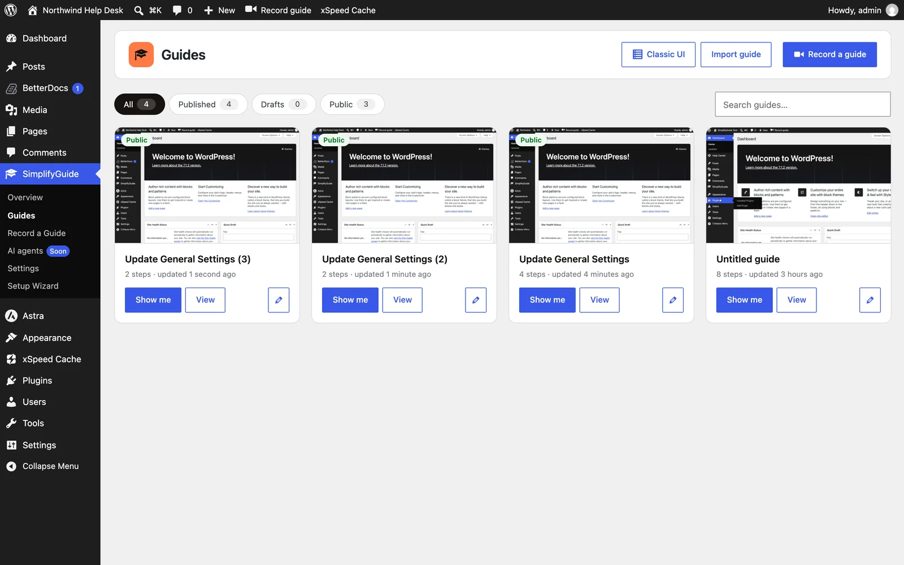
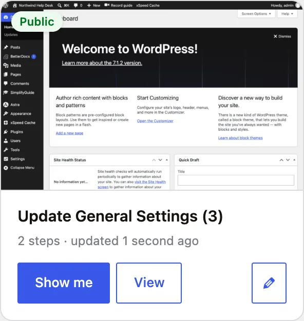
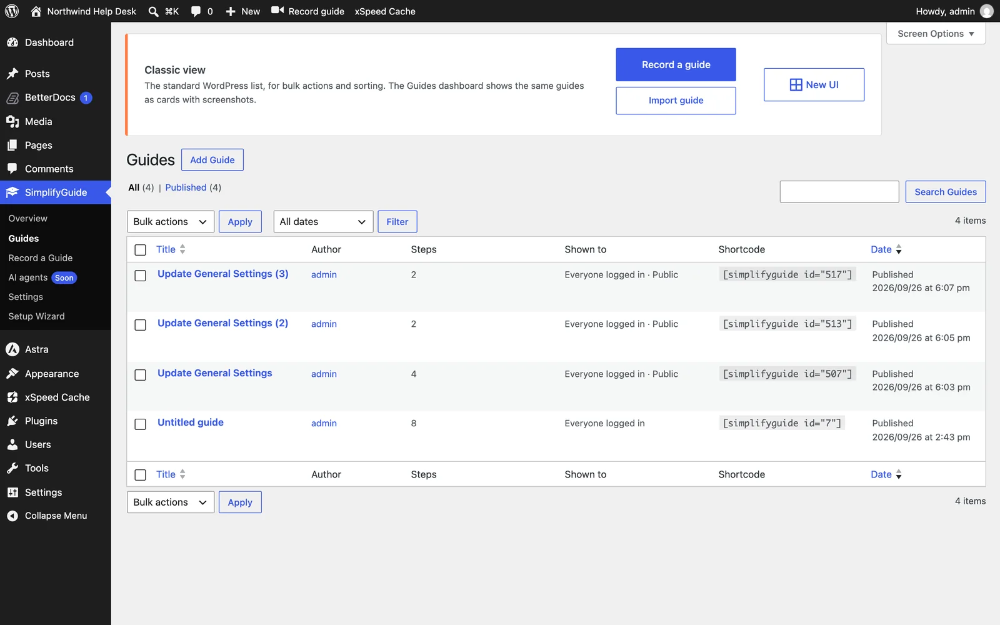
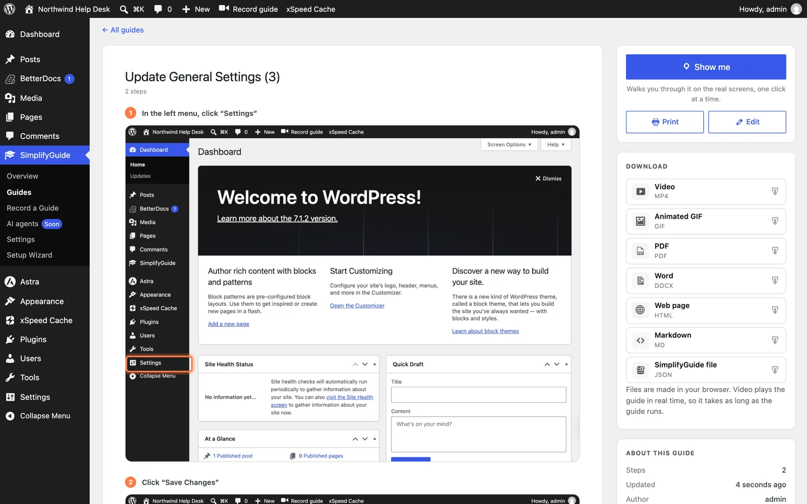
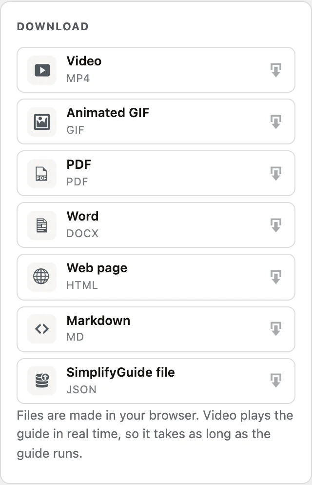

SimplifyGuide adds one menu to WordPress. What it shows depends on who is
looking:

- **Authors** — anyone who can edit posts — see **SimplifyGuide**, with the
  **Guides** dashboard, the recorder and settings.
- **Everyone else** sees **Help Center**, listing the published guides meant
  for their role. Someone with no guides to see gets no menu at all.

It is the same page underneath, so a link to a guide works for both.

## The Guides dashboard

**SimplifyGuide → Guides** shows every guide you can see as a card, newest
change first.

Along the top:

- **Classic UI** — the standard WordPress list, below.
- **Import guide** — create a guide from a SimplifyGuide file. Shown to
  authors who can upload files. See
  [Exports](/product/simplifyguide/docs/exports/#importing-a-simplifyguide-file).
- **Record a guide** — opens the recorder.

### Filters and search

| Filter | Shows |
| --- | --- |
| **All** | Every guide you can see |
| **Published** | Guides in the Help Center |
| **Drafts** | Drafts, pending and private guides |
| **Public** | Guides marked Public, published or not |

Each chip shows its count. The **Search guides…** box matches the title, the
description and the text of every step, as you type.

Your filter and search are kept in the address — `?status=draft&q=invoice` —
so they survive a reload and you can share or bookmark a filtered view.

### Guide cards

Each card shows the first screenshot in the guide, a **Draft** or **Public**
badge where it applies, the title and description, and the number of steps and
when it was last updated. Below that:

- **Show me** — starts the [walkthrough](/product/simplifyguide/docs/show-me/).
  Only on guides with steps.
- **View** — opens the guide page.
- **Edit** (pencil) — opens the [editor](/product/simplifyguide/docs/editor/).
  Only on guides you can edit.

### Classic UI

**Classic UI** is the standard WordPress list, for bulk actions, trash and
sorting. It adds three columns — **Steps**, **Shown to** and **Shortcode** —
and **View**, **Show me** and **Record more** links under each title. **New
UI** takes you back to the dashboard.

## The guide page

Click a card or **View** to open a guide.

The main column is the guide as readers see it everywhere: title,
description, step count, and each step with its note and annotated screenshot.
Click a screenshot to open it full size.

The sidebar holds:

- **Show me** — "Walks you through it on the real screens, one click at a
  time."
- **Print** — prints the guide, or saves it as a PDF from the print dialog.
- **Edit** — only for people who can edit the guide.
- **Download** — every export format, one click each.
- **About this guide** — number of steps, when it was updated, and the author.
  People who can edit the guide also see **Shown to**: the roles it is for, and
  **Public** or **Draft** badges.
- **Steps** — a list of every step that jumps to it, with the step you are
  reading marked as you scroll. Shown on guides with more than one step.

## What readers see

People who cannot edit posts — Subscribers and Customers, for example — see a
simpler version:

- The menu is called **Help Center**, near the top of the admin menu.
- The page is titled **Help Center**, with search but no filters, no
  **Import** and no **Record a guide**.
- Only **published** guides appear, and only those meant for them: guides with
  their role ticked in **Who sees this guide**, guides with no roles ticked
  (which are for every logged-in user), and guides marked **Public**.
- Cards have **Show me** and **View**, but no edit button.
- If there is nothing for them yet, the page says **No guides yet** — "Guides
  shared with you will appear here."

Readers can still download guides from the **Download** card.

## The dashboard widget

Anyone with at least one published guide to see also gets a **Help Center** widget on the
WordPress dashboard. It lists up to eight of their published guides, newest
change first, each with a **Show me** link, and an **All guides** link to the
Help Center.

## Who can author

By default anyone with the `edit_posts` capability — Contributors and above —
is an author. Developers can change that with the
`simplifyguide_author_capability` filter. See
[Roles and capabilities](/product/simplifyguide/docs/roles-and-capabilities/).
