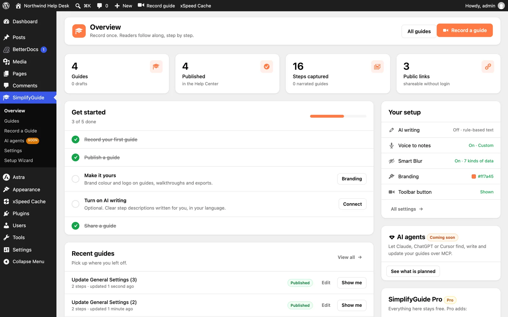

**SimplifyGuide → Overview** is the first item in the menu and the place to
start each session. It is shown to authors only; readers go straight to the
[Help Center](/product/simplifyguide/docs/help-center/).

The header has **All guides**, which opens the Guides dashboard, and **Record
a guide**.

If you are an administrator and have not finished the
[setup wizard](/product/simplifyguide/docs/setup-wizard/), a **Finish setting
up** banner sits under the header with **Open the setup wizard**.

## Stat cards

| Card | Counts | Underneath |
| --- | --- | --- |
| **Guides** | Every guide on the site: published, drafts, pending and private | How many are drafts or pending |
| **Published** | Published guides | "in the Help Center" |
| **Steps captured** | Steps across all guides | How many guides have narration |
| **Public links** | Guides marked Public | "shareable without login" |

**Public links** counts the **Public** setting, not where the guide is
embedded. See [Public guides](/product/simplifyguide/docs/public-links/).

## Get started

A checklist worked out from what already exists on your site. Each item ticks
itself off; you cannot tick them by hand. The card shows how many are done and
disappears once they all are.

| Item | Done when | Button |
| --- | --- | --- |
| **Record your first guide** | Any guide exists | **Record** |
| **Publish a guide** | Any guide is published | **Open guides** |
| **Make it yours** | The brand colour has been changed or a logo added | **Branding** |
| **Turn on AI writing** | An AI provider is ready to use | **Connect** |
| **Share a guide** | Any guide is marked Public | **Share** |

**Make it yours** and **Turn on AI writing** are only listed for
administrators, since only they can change settings.

## Recent guides

The five most recently changed guides, drafts included, each with its step
count, when it was updated, **Edit** (if you can edit it) and **Show me** (if
it has steps). **View all** opens the Guides dashboard.

## Your setup

Administrators only. A summary of the settings that matter most, each linking
to where it is changed:

| Row | Shows |
| --- | --- |
| **AI writing** | **On** and the provider, or **Off · rule-based text** |
| **Voice to notes** | **On** and the transcription provider, or **Recording only** |
| **Smart Blur** | **On** and how many kinds of data it hides, or **Off** |
| **Branding** | The brand colour, and **logo** if one is set |
| **Toolbar button** | Whether **Record guide** is **Shown** or **Hidden** in the toolbar |

**All settings** opens [Settings](/product/simplifyguide/docs/settings/).

## AI agents

Administrators only. Connecting AI assistants such as Claude, ChatGPT or
Cursor to your guides over MCP is planned, and this card is marked **Coming
soon**. **See what is planned** opens the **AI agents** page, which describes
it. Nothing on that page can be turned on yet. See
[AI agents and MCP](/product/simplifyguide/docs/ai-agents-mcp/).

## SimplifyGuide Pro

Shown while Pro is not installed. Everything in the free plugin stays free;
the card lists what Pro adds and links to **Learn about Pro**.

## Help

Along the bottom: **Documentation**, **Need help?**, **Suggest a feature** and
**Enjoying SimplifyGuide?**, each opening in a new tab.
