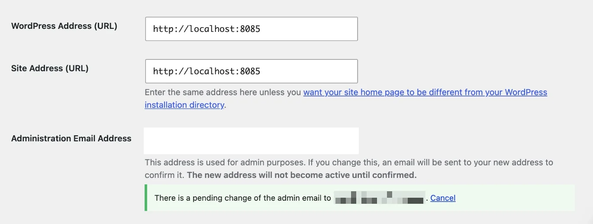

SimplifyGuide runs on your site. Guides are WordPress posts, screenshots and
narration are files in your Media Library, and nothing leaves your server
unless you add an AI key — and then only to the provider you picked.

## Smart Blur

While you record, SimplifyGuide looks for private data on the screen and
pixelates it **in your browser, before the screenshot is uploaded**. The
unblurred image never reaches your server.

Pixelation uses coarse blocks rather than a soft blur. A soft blur can
sometimes be sharpened back into readable text; coarse blocks cannot.

### Categories

Each category has its own switch under **Settings → General → Smart Blur**.
All are on by default.

| Category | What it matches |
| --- | --- |
| **Email addresses** | Anything shaped like `name@example.com` |
| **Phone numbers** | UK mobiles (`07…`, `+44 7…`), UK landlines (`020…`, `01…`, `+44 …`), international numbers written with a `+`, and North American numbers (`(555) 123-4567`, `555-123-4567`) |
| **Social Security numbers** | US format `123-45-6789` |
| **Credit card numbers** | 13 to 19 digits, with or without spaces or dashes, that pass the Luhn checksum |
| **IP addresses** | IPv4 (`203.0.113.7`) and full-form IPv6 (eight groups) |
| **MAC addresses** | `00:1a:2b:3c:4d:5e` or with dashes |
| **API keys and secrets** | Stripe-style `sk_live_…`, `pk_test_…`, `rk_…`; `sk-…` keys including `sk-ant-…` and `sk-proj-…`; GitHub tokens (`ghp_…`, `gho_…`, `ghu_…`, `ghs_…`, `ghr_…`); AWS access key IDs (`AKIA…`) |

Checks keep false alarms down:

- A card number must pass the **Luhn checksum**, so a 16-digit order number
  usually will not be blurred.
- Phone numbers, IPv4 addresses and SSNs are **not** blurred when they follow
  a label such as `Order #`, `Ref`, `Invoice`, `ID`, `SKU`, `Tracking`,
  `Ticket`, `Account` or `Version` — the usual sources of look-alikes.

Detection works on text: field values and the visible text of the page,
including inside the block editor's canvas. It cannot read text that is part
of an image. For that, use the editor's **Blur** tool (below).

### Password fields

Password fields with anything typed in them are always pixelated in
screenshots, even with every Smart Blur category switched off, and their values
are never written into step text.

### Share the tab, not a window

Smart Blur and **Blur element** work on screenshots cropped to your site,
which is what you get when you share **This tab** in a Chromium browser
(Chrome, Edge, Brave, Opera). If you share a whole window or screen instead —
and Firefox and Safari always do — the recorder cannot map page elements onto
the picture, so it could not blur anything. Rather than save unblurred
screenshots, it records the steps **without screenshots** and tells you so.
To get screenshots, record again in Chrome or Edge and share **This tab**.

### Step text

The switches control what is pixelated in screenshots. The check that keeps
values out of step text always uses **every** category. If you type an email
address into a field, the step reads *Fill in "Email"*, not the address,
even with the email switch off.

### Blur element while recording

For anything Smart Blur does not recognise — a customer name, an internal
note — press **Blur element** at the bottom of the recorder panel, then click
the element on the page. It is blurred in every screenshot for the rest of
the guide, and in the live page too, so you can see it worked. Click it again
to unblur. Press **Blur element** again when you are done.

A blurred element's value is also kept out of step text and out of the context
sent to AI. The guide remembers up to 50 blurred elements, so recording more
steps later keeps them hidden.

### Blur after the fact

Missed something? In the editor, choose the **Blur** tool on a step's
screenshot and drag over the area. The pixelated copy replaces the original
everywhere, and **the original file is deleted**, so the private version does
not linger in your Media Library. See
[Annotations](/product/simplifyguide/docs/annotations/).

## What is stored, and where

| What | Where |
| --- | --- |
| Guides | Posts of the private `simplifyguide` post type. Not reachable on the front end by URL. |
| Steps | One post meta entry per guide, `_simplifyguide_steps` |
| Version history | Post meta `_simplifyguide_history`, up to 20 versions and about 1 MB per guide |
| Audience, Public flag, start page, blurred elements | Post meta `_simplifyguide_audience`, `_simplifyguide_public`, `_simplifyguide_start_url`, `_simplifyguide_blur` |
| Screenshots | Media Library attachments, attached to the guide |
| Narration | One Media Library audio file per guide, attached to the guide |
| Settings | Options `simplifyguide_settings` and `simplifyguide_ai` (API keys encrypted) |

Steps also store a little **page context** — element type, nearby heading,
page title — used only to help AI write the step. It is never shown to readers
and is stripped from the REST response for anyone who cannot edit the guide.

### Screenshot and narration files

Files are uploaded under **random names** like `sg-3f9c…e1.webp`, so they
cannot be guessed from the guide or listed by walking numbers. Like all
WordPress media, though, anyone who has a file's exact link can open it.
Check screenshots before you make a guide public.

When a guide is permanently deleted (emptied from Trash), its screenshots and
narration are deleted with it. Files you have since reused elsewhere in the
Media Library are left alone.

## What AI providers receive

Nothing, unless you add a key. With a key, requests go from your server
straight to the provider:

- **Writing steps:** the guide title and each step's action, current text,
  element label, page path and page context.
- **Rewriting:** the one piece of text you asked to rewrite.
- **Transcribing:** the narration audio.

Screenshots are never sent. [AI providers](/product/simplifyguide/docs/ai-providers/)
has the full list.

## Uninstalling

Deactivating SimplifyGuide deletes nothing.

Deleting it from **Plugins** removes data only if **Settings → Advanced →
Delete data on uninstall** is on. It is off by default, so a reinstall does
not lose your guides.

With it on, deleting the plugin removes:

- every guide, in any status, including Trash;
- every screenshot and narration file attached to a guide;
- the `simplifyguide_settings` and `simplifyguide_ai` options, including your
  API keys.

Media you uploaded yourself and reused in a guide — a logo, an image you picked
from the Media Library — is not a SimplifyGuide file and is left alone.
