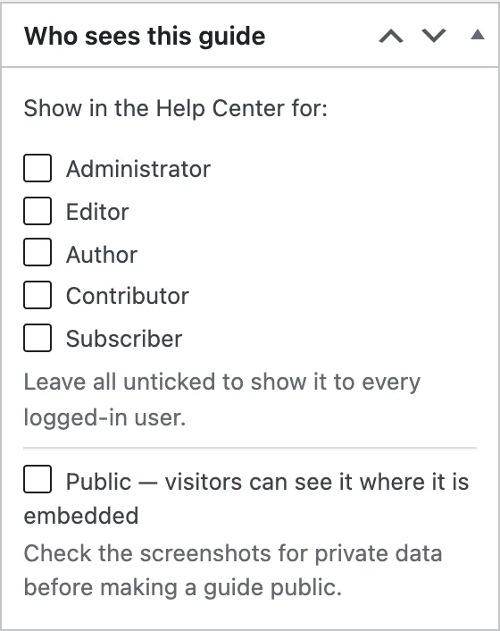

Guides are private to your site's logged-in users by default. The **Public**
setting lets people who are not logged in see a guide — but only where you
have [embedded](/product/simplifyguide/docs/embed/) it.

## Making a guide public

1. Open the guide in the [editor](/product/simplifyguide/docs/editor/).
2. In **Who sees this guide**, tick **Public — visitors can see it where it
   is embedded**.
3. Press **Update** (or **Publish**).
4. Embed the guide on a page with the SimplifyGuide block or the shortcode, if
   you have not already.

Public guides get a **Public** badge on their card in the Guides dashboard,
and the **Public** filter lists them all.

## What Public means

- **Visitors can see the guide wherever it is embedded** — on any post or page
  that contains its block or shortcode, whether or not they are logged in.
- **Every logged-in user can see it**, whatever roles are ticked. A public
  guide appears in the Help Center of every user, including roles you left
  unticked, and they can run **Show me** on it and download it.
- **It must be published.** A draft is never shown to visitors, public or not.

## What Public does not mean

- **There is no standalone public address.** SimplifyGuide does not create a
  page for the guide on your site. Visitors see it only on the pages where you
  put it. If you have not embedded it anywhere, ticking Public shows it to no
  one outside your site.
- **It is not listed or indexed on its own.** Guides are not in your site's
  search, archives or sitemap. The page you embed it on is indexed like any
  other page.
- **Visitors cannot run Show me.** The walkthrough is for logged-in users, on
  the screens they have access to.
- **It does not lock the screenshot files.** Screenshots are ordinary files in
  your Media Library. As with any upload, someone who has a file's address can
  open it, public guide or not. Blur or remove anything that must not be seen.
- **It does not share the guide outside your site.** Cloud share links that
  work without your site are planned for SimplifyGuide Pro.

## Check the screenshots first

A public guide shows its screenshots to anyone who can open the page. The box
says it plainly: **Check the screenshots for private data before making a
guide public.**

Before ticking **Public**, go through every step and look for:

- **Personal data** — names, email addresses, phone numbers, addresses in
  lists and forms.
- **Keys and secrets** — API keys, licence keys, tokens, passwords typed into
  fields.
- **Internal details** — order totals, customer lists, admin notices, plugin
  names you would rather not advertise, file paths.
- **The admin bar and menus** — they show your username and what is installed.

Smart Blur hides many of these automatically while you record, but it can only
hide what it recognises. For anything it missed, use **Blur** in the editor —
it replaces the screenshot and deletes the unblurred original. Or **Crop** the
screenshot down to the part that matters. See
[Annotations](/product/simplifyguide/docs/annotations/#blur-and-crop-change-the-image)
and [Privacy and Smart Blur](/product/simplifyguide/docs/privacy-and-smart-blur/).

The step text is public too. Recorded instructions name the buttons and fields
you used — read them through as well.

## Making a guide private again

Untick **Public** and press **Update**. Visitors immediately see nothing where
the guide was embedded. Anyone who already downloaded or printed it keeps
their copy.
