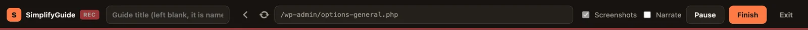
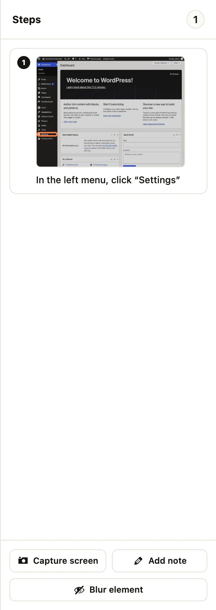
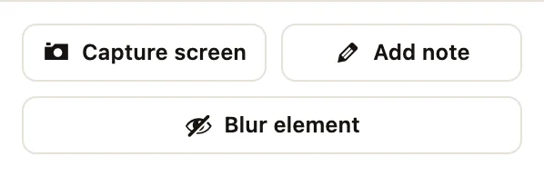
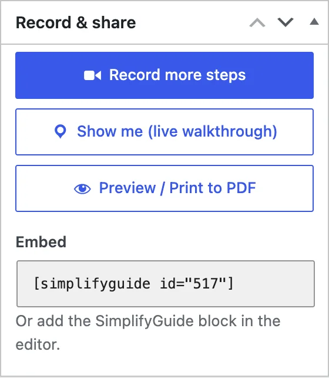

The recorder (the Recording Studio) loads your site inside a full-screen page
and watches what you do in it. Each click, typed field and choice becomes a
step with a screenshot. Because the recorder page itself never navigates, one
screen-sharing prompt covers the whole recording, however many screens you
move through.

## Opening the recorder

There are three ways in:

- **SimplifyGuide → Record a Guide** opens the recorder on your Dashboard.
- **Record guide** in the WordPress toolbar opens the recorder on the screen you
  are looking at — any admin screen, or any front-end page while you are logged
  in. The current address is passed along as `?start=`, so the recording starts
  exactly where you were.
- **Record more steps** in the guide editor adds to an existing guide. See
  [below](#recording-more-steps-into-a-guide).

The toolbar button is shown to anyone who can record (the `edit_posts`
capability — Authors and above by default). Hide it under **Settings → General
→ Toolbar button**.

## The bar

From left to right:

**Guide title.** Type a name, or leave it blank and the guide is named from
your steps when you press **Finish**. A title you type is never replaced. See
[Automatic titles](/product/simplifyguide/docs/auto-titles/).

**Address bar.** Shows the page loaded in the recorder. Type a path on your site
and press Enter to go there; while recording, that adds a "Go to …" step. The
**Back** and **Reload** buttons beside it work like the browser's own.

**Screenshots.** Take a screenshot for every step. On by default. Untick it to
record steps as text only, with no screen-sharing prompt. It cannot be changed
once recording has started.

**Narrate.** Record your voice while you work. See
[Voice narration](/product/simplifyguide/docs/voice-narration/).

**Start recording.** Asks to share the tab (when **Screenshots** is ticked),
creates the guide as a draft, and starts recording.

**Pause / Resume.** While paused, nothing you do is recorded and narration
pauses too. Use it to set something up that should not be part of the guide.

**Finish.** Saves the remaining steps, names the guide if needed and opens it
in the editor.

**Exit.** Leaves the recorder. If you are recording, you are asked to confirm.
Steps recorded so far are kept, and you land in the guide editor; if nothing
was recorded yet, you return to your guides.

While recording, the bar shows a red **REC** badge; while paused, **PAUSED**.

Screenshots and narration are uploaded to your Media Library, so both
checkboxes are unavailable to users who cannot upload files.

## Sharing the tab

Browsers only let a page take screenshots of itself through screen sharing.
When you press **Start recording**, your browser asks what to share: choose
**This tab**. SimplifyGuide shows a reminder at the same moment.

What you get depends on the browser and what you share:

- **Chrome, Edge and other Chromium browsers**, sharing this tab: screenshots
  are cropped to your site, without the recorder's own bar and panel.
- **Firefox and Safari**, or sharing a window or the whole screen: steps are
  recorded **without screenshots**, because nothing in a shared window can be
  blurred. SimplifyGuide tells you when this happens.
- **Declined**, or a browser that cannot share: steps are still recorded, just
  without screenshots.

If you stop sharing part-way, recording carries on and new steps have no
screenshot.

Screen capture needs HTTPS (or `localhost`). On a plain-HTTP site the browser
refuses it, and steps are recorded without screenshots.

## What is captured

| You do | The step reads |
| --- | --- |
| Click a button, link, tab or menu item | Click “Save Changes” · In the left menu, go to Posts → Add New · Open the “Advanced” tab |
| Type in a text field | Type “Northwind” in “Site Title” |
| Choose from a dropdown | Choose “Contributor” in “New User Default Role” |
| Tick or untick a checkbox, pick a radio button | Tick “Anyone can register” · Untick “…” · Select “…” |
| Drag an item (sortable lists, drag and drop) | Drag “…” to “…” |
| Press a keyboard shortcut | Press Ctrl+S |
| Copy, cut or paste | Copy “…” · Paste into “…” |

A few details:

- **Typing** becomes a step when you leave the field — by clicking something
  else, pressing Enter, pausing or finishing — so you can type, correct and
  retype freely. Unchanged or empty fields are not recorded.
- **Double clicks** count once, and two quick clicks on neighbouring elements
  (a menu opening, a corrected mis-aim) are merged into one step.
- **Keyboard shortcuts** are recorded when they use Ctrl, Alt or Cmd, or are
  Esc or a function key. Ordinary editing inside a field — select all, undo,
  arrow keys — is not.
- **Links that open a new tab** open inside the recorder instead, so the
  recording can follow them.
- **The block editor** is followed too, including clicks inside its canvas.

Recording only works on your own site. A link to another site cannot be
recorded.

## What is not captured

- **Password values.** A password field becomes Fill in “Password”: the value
  is never written into the step. With Smart Blur on, the field is also
  pixelated in the screenshot.
- **Sensitive values.** Values that look like an email address, phone number,
  card number, Social Security number, IP or MAC address, or API key are never
  written into step text, whichever Smart Blur categories are on. In
  screenshots, the categories you have switched on are pixelated in your
  browser before the image is uploaded.
- **Blurred elements.** Text typed into or copied from an element you blurred
  is left out of the step (Fill in “…”, Copy the selected text).
- **Anything while paused**, and anything outside the recorder's site area.

Smart Blur categories are set in the
[setup wizard](/product/simplifyguide/docs/setup-wizard/#privacy) or under
**Settings → General**. See
[Privacy and Smart Blur](/product/simplifyguide/docs/privacy-and-smart-blur/)
for what each category matches.

## The steps panel

Steps appear on the right as you record, with a thumbnail and a highlight box
around what you clicked. The number at the top is the step count. Each step is
saved to the guide as you go, so a closed tab does not lose your work; the
browser warns you if you try to leave while steps are still uploading.

To remove a step, hover over it and press the **×**.

### Capture screen

Adds a step with a screenshot of the screen as it is now, without clicking
anything. You are asked for a caption (it suggests "Check this screen"). Use it
to show a result: the saved settings, the published post. Available while
recording.

### Add note

Adds a text-only step with no screenshot — a tip, a warning, or an instruction
that happens away from the screen. Available while recording.

### Blur element

Turns on blur mode. Click anything on the page to blur it in every screenshot
of this guide; click it again to unblur. Press **Blur element** again when you
are done. While blur mode is on, clicks pick elements instead of pressing them,
and nothing is recorded.

Blurred elements stay blurred in the recorder too, so you can see what is
hidden. A blurred field shows its content while you are typing in it and blurs
again when you leave it. You can blur elements before you start recording.

The blur list is saved with the guide and applies when you record more steps
into it later. To blur part of a screenshot after recording, use the **Blur**
tool in the editor — see [Annotations](/product/simplifyguide/docs/annotations/).

## Recording more steps into a guide

To add to a guide you already have:

1. Open the guide in the editor.
2. In the **Record & share** box, press **Record more steps** (**Record steps**
   if it has none yet). In the classic guides list, the row action is **Record
   more**.

The recorder opens on the screen where the guide's last step happened, with the
guide's title filled in. New steps are added after the existing ones. Press
**Finish** and you are back in the editor.

If the guide was named automatically and you leave the title as it is, the name
is worked out again from all the steps, old and new. A title you typed or
edited yourself stays. See
[Automatic titles](/product/simplifyguide/docs/auto-titles/#recording-more-steps).

If you tick **Narrate** when recording more steps, the new narration replaces
the guide's earlier narration. See
[Voice narration](/product/simplifyguide/docs/voice-narration/).

## When you press Finish

1. Any field you were still typing in is recorded.
2. The guide is named from its steps, unless you typed a title.
3. Narration, if any, is uploaded and, if a voice provider is set up,
   transcribed into step notes.
4. If **Settings → AI writing → Rewrite on Finish** is on and AI is set up,
   every step is rewritten by AI. See
   [AI rewrite](/product/simplifyguide/docs/ai-rewrite/).
5. The guide opens in the editor as a draft.

If narration or AI fails, the recorded steps are kept and the editor tells you
what went wrong.

## Who can record

Anyone with the `edit_posts` capability — Authors, Editors and Administrators
by default. Developers can change this with the
`simplifyguide_author_capability` filter.
