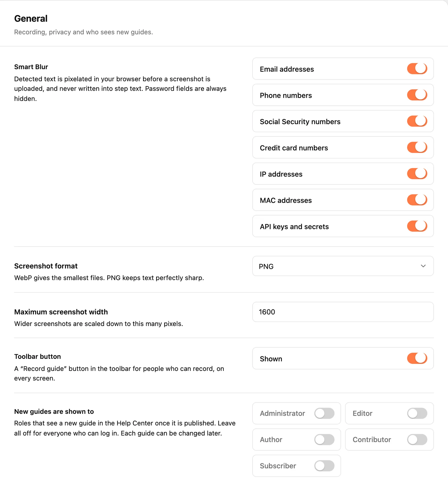
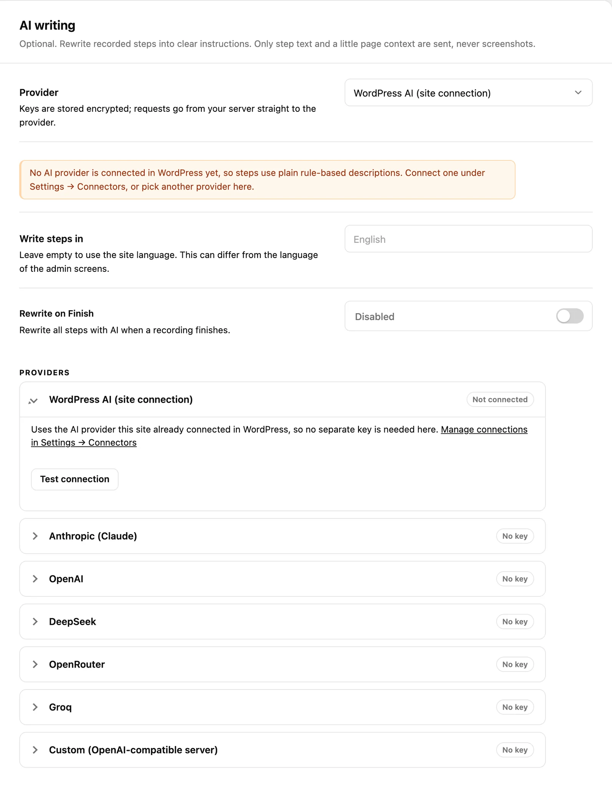
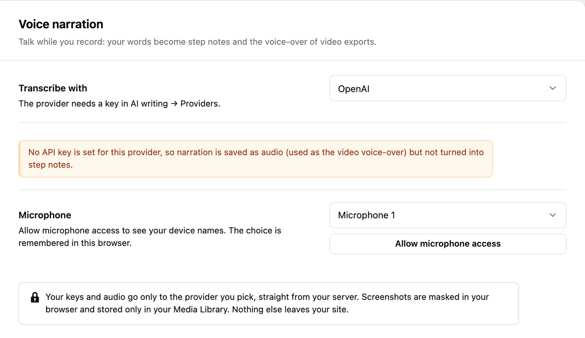
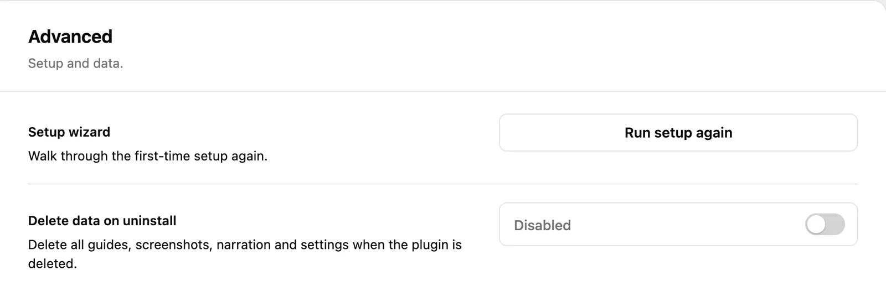

Everything here lives under **SimplifyGuide → Settings**. Only administrators
see the screen (it needs the `manage_options` capability). The settings are
split over five tabs, and one **Save changes** button at the bottom saves all
of them at once.

Changes apply to new recordings and exports. Screenshots you have already
taken are not re-processed when you change the format, width or Smart Blur
categories.

The setup wizard writes to the same settings, so anything you chose there
shows up here and can be changed at any time.

## General

Recording, privacy and who sees new guides.

| Setting | Default | What it does |
| --- | --- | --- |
| **Smart Blur** | All seven categories on | Text that matches a category is pixelated in your browser before a screenshot is uploaded. |
| **Screenshot format** | WebP (recommended) | WebP, JPEG or PNG. WebP gives the smallest files; PNG keeps text perfectly sharp. |
| **Maximum screenshot width** | 1600 px | Wider screenshots are scaled down to this many pixels. Accepts 800 to 3840. |
| **Toolbar button** | Shown | A **Record guide** button in the toolbar, on every screen, for people who can record. |
| **New guides are shown to** | All off (everyone who can log in) | The roles that see a new guide in the Help Center once it is published. |

### Smart Blur

Seven switches, one per category: **Email addresses**, **Phone numbers**,
**Social Security numbers**, **Credit card numbers**, **IP addresses**, **MAC
addresses** and **API keys and secrets**. Turn off a category only if it keeps
blurring something you genuinely want readers to see — an IP address in a
server-setup guide, say.

Two things to know:

- **Step text never contains a detected value**, whichever categories are on.
  The switches decide what is pixelated in the picture; the text check always
  uses every category.
- **Password fields** with anything typed in them are always pixelated, even
  with every category off.

See [Privacy and Smart Blur](/product/simplifyguide/docs/privacy-and-smart-blur/)
for exactly what each category matches.

### New guides are shown to

This is the starting audience for every new guide, however it was created —
recorded, imported or added blank. Leave every role off to show new guides to
everyone who can log in. Each guide's audience can be changed later in its
**Who sees this guide** box; see
[Roles and capabilities](/product/simplifyguide/docs/roles-and-capabilities/).

## Branding

Your colour and logo on highlights, walkthroughs and exports.

| Setting | Default | What it does |
| --- | --- | --- |
| **Brand colour** | `#ff7a45` (orange) | Click highlights, walkthrough spotlights and export accents. |
| **Logo** | None | Shown on PDF, Word, GIF and video exports. |
| **Footer line** | Empty | Printed at the bottom of exports. |
| **Credit** | Hidden | Shows "Made with SimplifyGuide" on exports. |

[Branding](/product/simplifyguide/docs/branding/) covers each of these in
detail, including where the colour and logo appear.

## AI writing

Optional. AI rewrites recorded steps into clear instructions. Only step text
and a little page context are sent, never screenshots.

| Setting | Default | What it does |
| --- | --- | --- |
| **Provider** | WordPress AI (site connection) on WordPress 7.0+ with AI available; otherwise Anthropic (Claude) | Which provider writes step text. |
| **Write steps in** | Empty (site language) | The language AI writes in. Can differ from the language of the admin screens. |
| **Rewrite on Finish** | Disabled | Rewrite all steps with AI when a recording finishes. |
| **Providers** | No keys | One card per provider: API key, model, and an optional server of your own. |

Under the provider picker, a status line tells you where you stand:

- **Ready: steps can be written by …** — the chosen provider has a key and a
  model, and AI writing is on.
- **No API key is set for this provider, so steps use plain rule-based
  descriptions.** — nothing is broken; steps are still written by
  SimplifyGuide's own rules. Add a key to turn on AI writing.

**Write steps in** suggests a list (English, Español, Français, Deutsch,
简体中文, 日本語 and others) but accepts any language name you type.

[AI providers](/product/simplifyguide/docs/ai-providers/) explains each
provider card, keys and models.

## Voice narration

Talk while you record: your words become step notes and the voice-over of
video exports.

| Setting | Default | What it does |
| --- | --- | --- |
| **Transcribe with** | OpenAI | The provider that turns narration into text: OpenAI, Groq or Custom (OpenAI-compatible server). It needs a key in **AI writing → Providers**. |
| **Microphone** | Not allowed yet | Press **Allow microphone access** to see your device names and pick one. |

The microphone choice is not saved with the other settings. It is remembered in
the browser you picked it in, because devices differ between computers.

Without a transcription key, narration is still recorded and saved as audio —
video exports use it as the voice-over — it just is not turned into step
notes. See [Voice narration](/product/simplifyguide/docs/voice-narration/).

## Advanced

Setup and data.

| Setting | Default | What it does |
| --- | --- | --- |
| **Setup wizard** | — | **Run setup again** reopens the [setup wizard](/product/simplifyguide/docs/setup-wizard/). |
| **Delete data on uninstall** | Disabled | Deletes all guides, screenshots, narration and settings when the plugin is deleted. |

Leave **Delete data on uninstall** off unless you are removing SimplifyGuide
for good. With it off, deleting the plugin leaves your guides in place, so a
reinstall picks up where you left off. Deactivating the plugin never deletes
anything, whatever this is set to.

## Where settings are stored

Two rows in `wp_options`:

| Option | Contents |
| --- | --- |
| `simplifyguide_settings` | General, Branding and Advanced |
| `simplifyguide_ai` | AI writing and Voice narration, including API keys (encrypted) |
