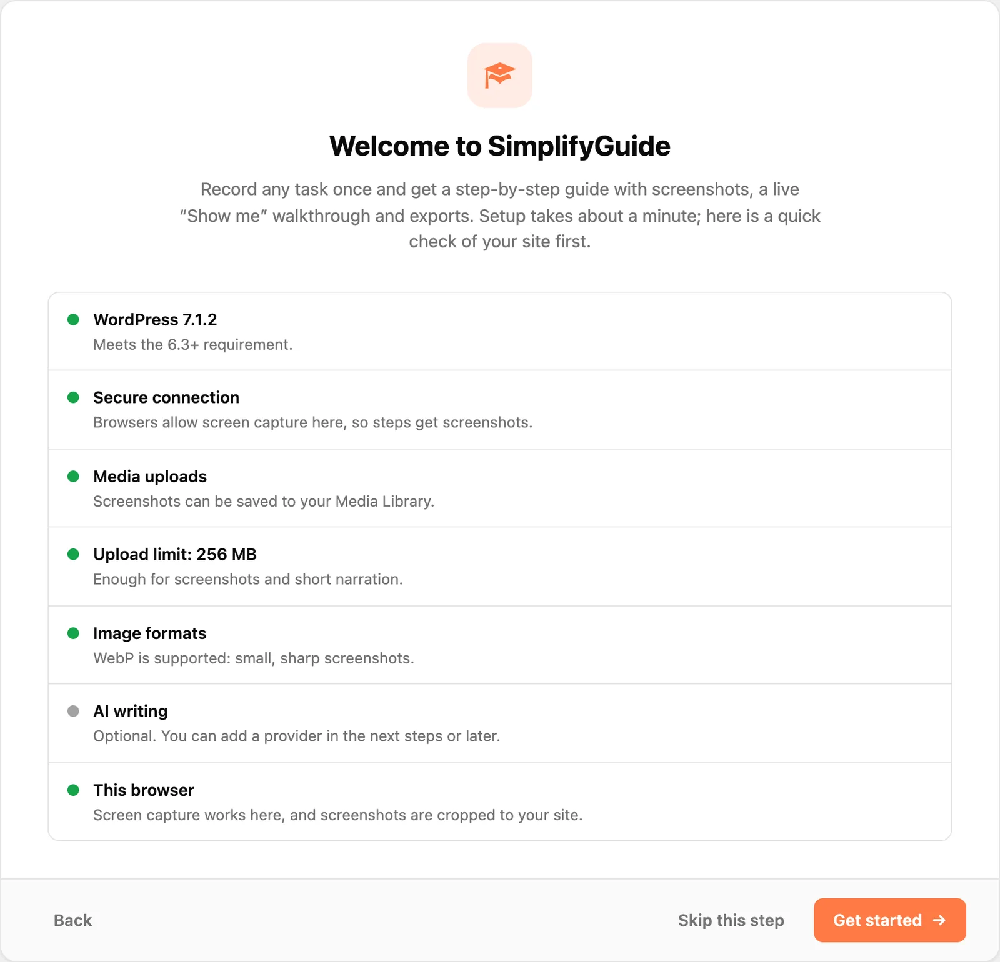
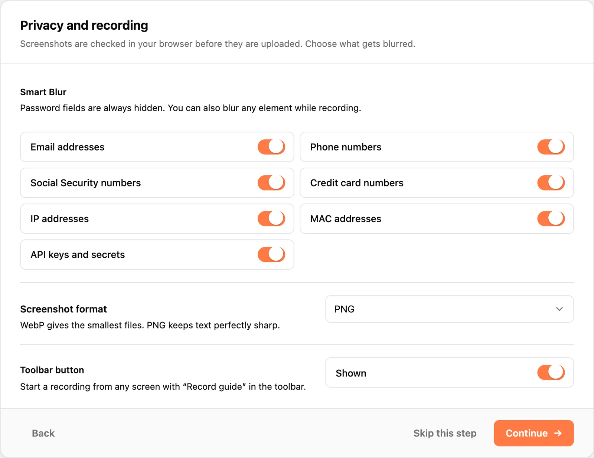
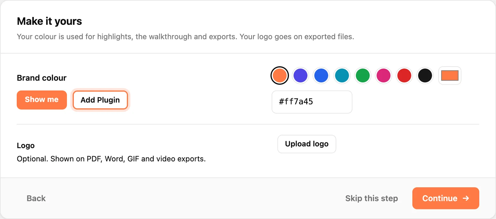
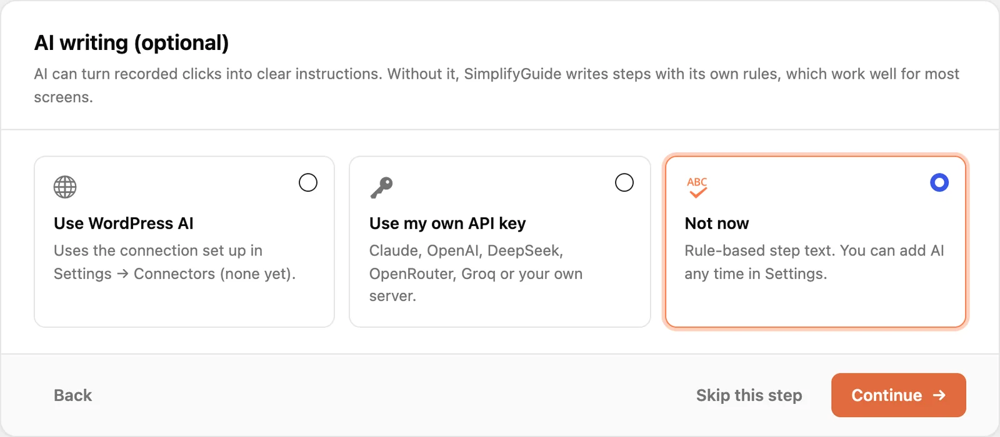
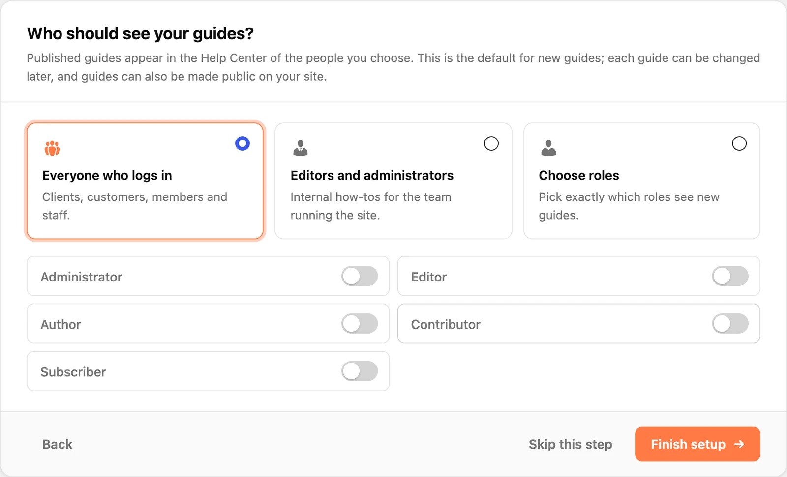
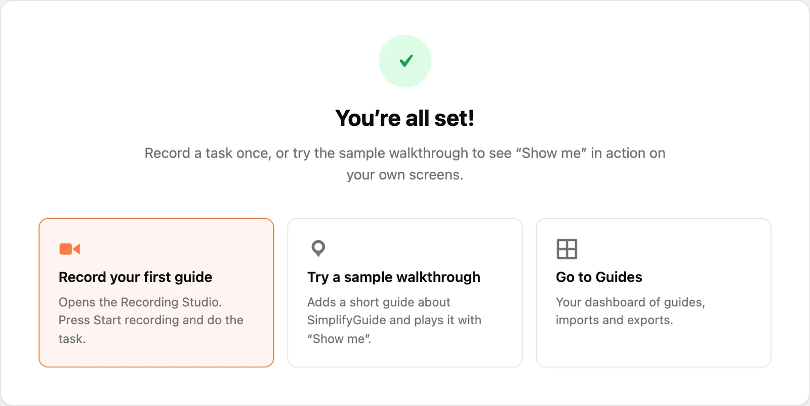

The setup wizard opens once, right after you activate SimplifyGuide. It checks
your site, then asks four questions: what to blur, how to brand guides, whether
to use AI, and who sees new guides. It takes a couple of minutes.

Each step is saved as soon as you press **Continue**, so leaving half-way keeps
what you already chose. Everything the wizard sets can be changed later under
**SimplifyGuide → Settings**.

At the bottom of each question step you have three buttons:

- **Continue** saves the step and moves on.
- **Skip this step** moves on without saving that step's choices.
- **Back** returns to the previous step.

**Skip setup**, top right, marks setup as done and takes you to the Guides
dashboard.

## Welcome

A quick check of your site. Nothing is saved here; the list tells you whether
anything will limit what SimplifyGuide can do.

| Check | What it tells you |
| --- | --- |
| **WordPress** | Whether your version meets the 6.3+ requirement. |
| **Secure connection** / **No HTTPS** | Browsers only allow screen capture on HTTPS (or `localhost`). Without it, steps are recorded without screenshots. |
| **Media uploads** | Whether screenshots can be saved to your Media Library. |
| **Upload limit** | Your server's maximum upload size. Below 8 MB, long narration may not upload. |
| **Image formats** | Whether the server can handle WebP. If not, JPEG is used. |
| **AI writing** | Whether WordPress already has an AI connection SimplifyGuide can use. Optional either way. |
| **This browser** | Whether the browser you are using can capture the screen, and whether it crops screenshots to your site (Chrome and Edge) or includes the whole window. |

An amber dot is a warning, not a blocker. You can still record; see
[Installation](/product/simplifyguide/docs/installation/#requirements) for what
each one means.

Press **Get started** to continue.

## Privacy

**Smart Blur** chooses what is pixelated in screenshots before they leave your
browser. The categories are:

- Email addresses
- Phone numbers
- Social Security numbers
- Credit card numbers
- IP addresses
- MAC addresses
- API keys and secrets

All are on by default. Password fields are always hidden, whatever you choose
here, and you can blur any other element by hand while recording — see
[Recording](/product/simplifyguide/docs/recording/#blur-element). For how
detection works, see
[Privacy and Smart Blur](/product/simplifyguide/docs/privacy-and-smart-blur/).

**Screenshot format** is WebP (recommended, smallest files), JPEG, or PNG
(sharpest text).

**Toolbar button** shows or hides the **Record guide** button in the WordPress
toolbar. It is shown by default.

## Branding

**Brand colour** is used for click highlights, the **Show me** walkthrough and
export accents. The preview beside it updates as you pick. The default is
`#ff7a45`.

**Logo** is optional. Press **Upload logo** to choose an image from the Media
Library. It appears on PDF, Word, GIF and video exports.

More branding options — a footer line and the "Made with SimplifyGuide" credit
— are under **Settings → Branding**. See
[Branding](/product/simplifyguide/docs/branding/).

## AI writing

AI is optional. Without it, SimplifyGuide writes each step with its own rules
("In the left menu, go to Posts → Add New"), which work well for most screens.
Choose one:

- **Use WordPress AI** — only offered when your WordPress version supports it.
  Uses the connection set up under **Settings → Connectors**, with no key
  needed here.
- **Use my own API key** — pick a **Provider** (Anthropic (Claude), OpenAI,
  DeepSeek, OpenRouter or Groq), paste your **API key**, and press **Check key**
  to test it before you continue. Keys are stored encrypted, and requests go
  from your server straight to the provider.
- **Not now** — rule-based step text. Nothing is changed.

Choosing **Not now** does not remove a provider you set up earlier. To connect
your own server, choose a model, or set the language steps are written in, use
**Settings → AI writing**. See
[AI providers](/product/simplifyguide/docs/ai-providers/).

## Audience

This sets who sees a new guide in the Help Center once it is published. It is
only the default: each guide has its own **Who sees this guide** box in the
editor, and a guide can also be made public.

- **Everyone who logs in** — clients, customers, members and staff. This is the
  default.
- **Editors and administrators** — internal how-tos for the team running the
  site.
- **Choose roles** — tick exactly the roles that should see new guides.

The same setting is **Settings → General → New guides are shown to**, where
leaving every role off means everyone who can log in.

Press **Finish setup** to save and complete the wizard.

## Done

Three ways to carry on:

- **Record your first guide** opens the recorder. Follow
  [Your first guide](/product/simplifyguide/docs/first-guide/).
- **Try a sample walkthrough** adds a short, published guide called "Get to
  know SimplifyGuide" and plays it with **Show me** on your own screens. It is
  added only once; pressing it again replays the same guide.
- **Go to Guides** opens the Guides dashboard.

## Running it again

Open **SimplifyGuide → Setup Wizard**, or press **Run setup again** under
**SimplifyGuide → Settings → Advanced**. Each step opens with your current
settings already filled in, so you can change one answer and skip the rest.

Only administrators (users who can manage options) can run the wizard.
