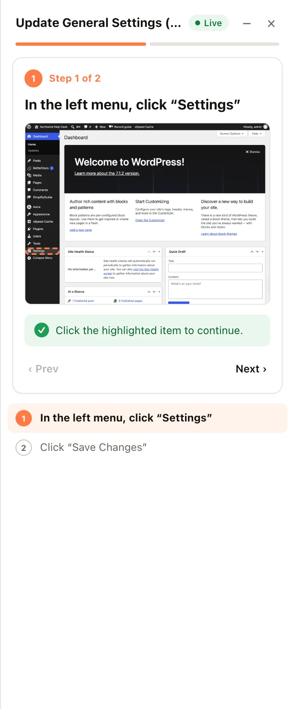
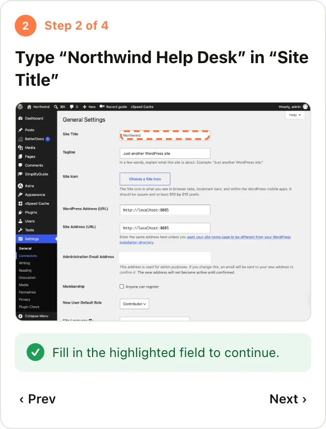
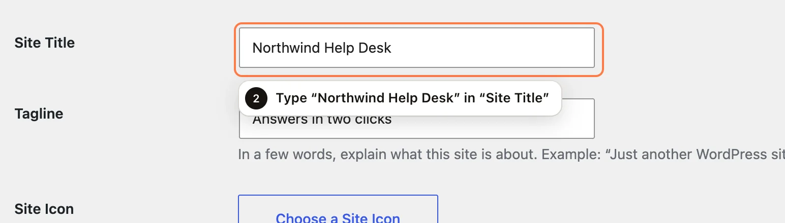
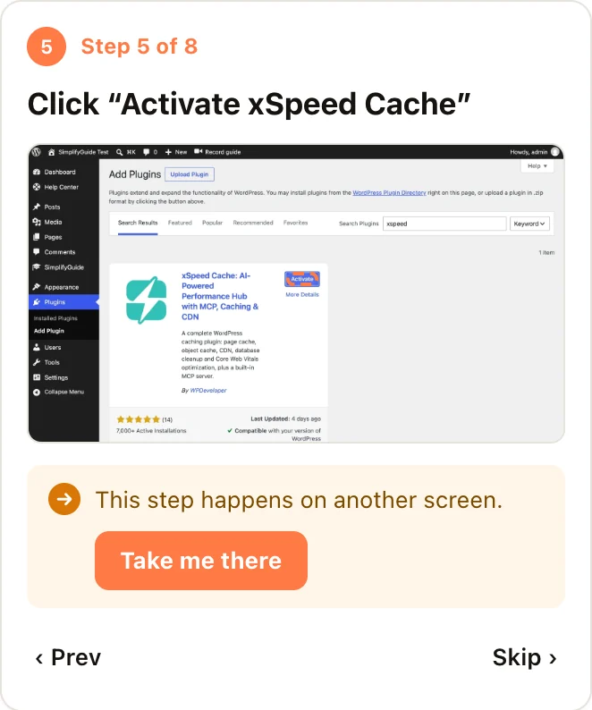
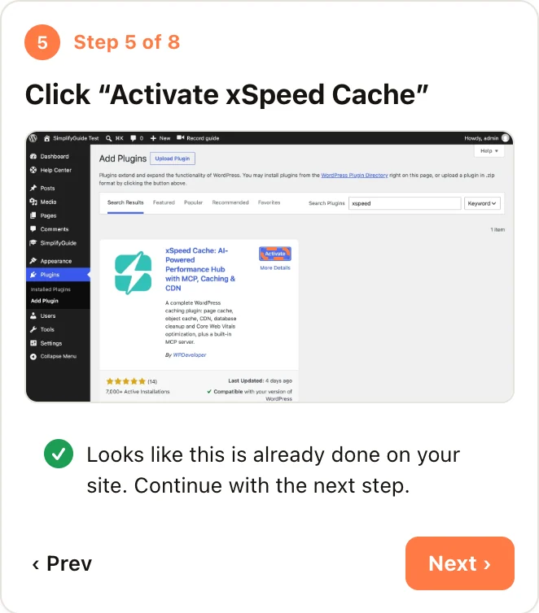

A guide tells people what to do. **Show me** does it with them: it opens a
panel at the side of the screen, finds the button or field for the current
step on the real page, outlines it, and moves on by itself when the reader
uses it.

## Starting a walkthrough

**Show me** buttons appear wherever a guide with steps is listed:

- On each card in the **Guides** dashboard or **Help Center**.
- At the top of the sidebar when you view a guide.
- In the **Help Center** widget on the WordPress dashboard.
- On the **Overview** page, next to each recent guide.
- In the editor's **Record & share** box, as **Show me (live walkthrough)**.
- As a row action in the classic guide list.

Each of these is a link to your admin with `?simplifyguide_tour=` and the
guide's ID, for example `/wp-admin/?simplifyguide_tour=42`. You can put that
link anywhere — a support email, a checklist, a button on an internal page —
and it starts the walkthrough for whoever opens it.

The reader must be logged in and allowed to see the guide. If they are not,
they get **This walkthrough could not be loaded.**

When the walkthrough starts, it goes straight to the screen where the first
step was recorded, unless the first element is already on the current page.

## The panel

From top to bottom:

- **Guide title** and a status: **Live**, **Looking**, **Other page**, **Not
  found** or **Done**.
- **Minimise** (–) and **End walkthrough** (×).
- **Progress** — one segment per step.
- **The current step** — **Step 3 of 8**, the instruction, the note, and the
  recorded screenshot with its highlight, so the reader can compare it with
  what they see.
- **What to do now** — depends on the state, below.
- **‹ Prev** and **Next ›** (or **Skip ›**, or **Finish ›** on the last step).
- **All steps** — the full list. Completed steps show a tick. Click any step
  to jump to it.

On wide screens the panel pushes the page aside instead of covering it. On
screens narrower than 900 pixels it sits over the page.

Progress is kept for the browser tab. The walkthrough follows the reader from
screen to screen in that tab — including through page loads and form
submissions — and nowhere else. Closing the tab ends it.

## What the reader sees on each step

### Found

The element is on screen. It gets an outline in your brand colour and a small
label with the step number and instruction, and the page scrolls to it if
needed. The card says **Click the highlighted item to continue.**, or for a
field, **Fill in the highlighted field to continue.**

The walkthrough moves on when the reader does the step:

- **A click** on the outlined item.
- **A field** once its value actually changes — tabbing through or leaving it
  as it was does not count. A text field must not be left empty.

It waits a moment after the action so the page can react, then shows the next
step — on the same screen or the next one.

### Searching

While it looks, the card says **Looking for "…" on this screen…** and **Next**
is disabled, so nobody skips a step by accident. It keeps looking as the page
changes, which covers menus that open, search results and screens that load in
pieces. After about four and a half seconds it gives up and says why — but it
keeps watching, and still picks the element up if it appears later.

### On another screen

The step was recorded on a different screen from the one the reader is on. The
card says **This step happens on another screen.** with a **Take me there**
button that opens it. Links that would leave your site are refused.

### Already done

Some steps cannot be found once they have been done: after **Activate**,
WordPress shows **Deactivate** instead. For steps whose element starts with
**Install**, **Activate**, **Enable** or **Connect**, Show me looks for the
finished state next to the same name — "Active", "Installed", "Disconnect" and
so on. If it finds one, the card says **Looks like this is already done on
your site. Continue with the next step.** and **Next** is highlighted.

### Not found

The reader is on the right screen, but the element is not there. The card says
**We hit a roadblock: this item is not on the screen. Try taking the action
yourself, or skip this step.**

Often the screen is just in a different state — other search results, a
filter, a closed panel. So the card also offers:

- **Reload this screen**, if the reader is already at the exact address the
  step was recorded on.
- **Open the screen as recorded**, if the address differs — for example, the
  step was recorded with a search term or filter the reader does not have.

If neither helps, **Skip** moves on. See
[Writing reliable guides](/product/simplifyguide/docs/reliable-guides/) for
why an element might not be found.

### Text steps

Steps with nothing to click — notes, keyboard shortcuts — just show their text
with **Next**.

## Moving around

- **‹ Prev** — back one step.
- **Next ›** — forward. It reads **Skip ›** while the step has not been found,
  and is disabled while it is still looking.
- **All steps** — jump straight to any step.

After the last step the card says **All done!** with **Start over** and
**Close**.

## Minimising and closing

**Minimise** (or **Esc**) folds the panel into a small pill at the edge of
the screen showing the current step number and instruction. The outline on the
page stays, and the walkthrough keeps advancing as the reader works. Click the
pill to open the panel again.

**End walkthrough** (×) stops the walkthrough and removes the panel and
outline.

## Where it works

- **Anywhere a logged-in user goes** on your site — the admin and the front
  end. It never runs inside frames, such as the recorder's.
- **Inside frames on the page**, such as the block editor's canvas, when they
  are on your own site.
- **Only for logged-in users.** Visitors who see a
  [public guide](/product/simplifyguide/docs/public-links/) embedded on a page
  can read it, but cannot start a walkthrough.
