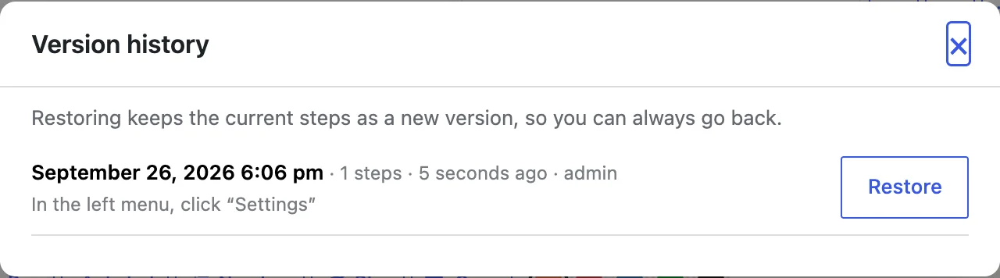

Each time a guide's steps change, SimplifyGuide keeps a copy of how they were
before. If a rewrite, a re-recording or a round of edits goes wrong, you can
put an earlier version back.

## Opening it

In the [editor](/product/simplifyguide/docs/editor/), press **Version
history** above the steps.

Each version shows:

- **When** it was saved, as a date and time and as "… ago".
- **How many steps** it had.
- **Who** made the change that replaced it.
- **The first five step titles**, joined by arrows, so you can recognise it.

The newest version is at the top. On a guide that has never changed, the dialog
says **No earlier versions yet. A version is kept every time the steps
change.**

## Restoring a version

1. Open **Version history**.
2. Find the version you want and press **Restore**.
3. If you have unsaved changes in the editor, you are asked to confirm —
   restoring discards them.

The version is put back immediately; you do not need to press **Update**. A
notice confirms which version was restored.

Before it restores, SimplifyGuide saves the current steps as a new version. So
a restore is never a dead end: if you picked the wrong one, open **Version
history** again and restore the version at the top.

## When a version is kept

A version is kept whenever the stored steps change: pressing **Update** after
editing, recording more steps, an AI rewrite on Finish, a transcription, a
blur or a crop. Saving without changing any step does not create one.

Recording adds steps one at a time, so to avoid a version for every click,
changes by the same person less than a minute apart are folded into one.

## What is kept

- **The steps** — instructions, notes, source badges, highlights,
  annotations, and which screenshot each step uses.
- **Up to 20 versions.** Past that, the oldest is dropped.
- **Up to 1 MB of history per guide.** If the versions add up to more than
  that, the oldest are dropped until they fit. The most recent version is
  always kept.

What is not kept:

- **The page context** captured while recording for
  [AI rewrite](/product/simplifyguide/docs/ai-rewrite/). It is stripped from
  saved versions, which keeps them small. A restored step still works in the
  guide and in **Show me**, but **Write this step from the recording** has less
  to go on.
- **The guide's title, description and who sees it.** Version history covers
  the steps only.
- **Screenshots themselves.** A version records which image each step used,
  not a copy of it. **Blur** and **Crop** replace the image and delete the
  original, so an older version cannot bring back an unblurred or uncropped
  screenshot — that step shows no screenshot instead. The same applies to an
  image you deleted from the Media Library.

## Who can use it

Anyone who can edit the guide can see its history and restore a version.
